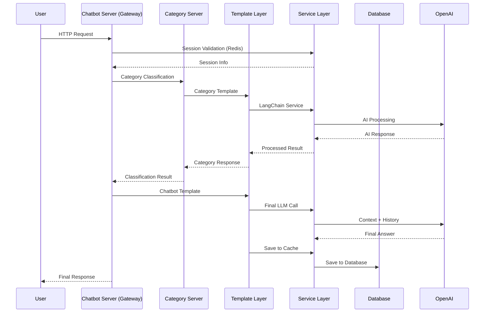

# 의료 AI 플랫폼 아키텍처 분석

## 🏥 프로젝트 개요
**FastAPI 기반 LLM 연동 의료 서비스 서버**는 마이크로서비스 아키텍처와 도메인 주도 설계(DDD)를 적용한 확장 가능한 의료 AI 플랫폼입니다.

## 🎯 핵심 아키텍처 철학

### 1. 계층형 아키텍처 (Layered Architecture)
```
┌─────────────────────────────────────┐
│        Application Layer            │ ← HTTP 진입점, 마이크로서비스
│        (FastAPI Servers)            │
├─────────────────────────────────────┤
│         Template Layer              │ ← 비즈니스 로직, 도메인 전문성
│      (Domain Business Logic)        │
├─────────────────────────────────────┤
│         Service Layer               │ ← 기술 서비스, 인프라 추상화
│   (Cache, DB, HTTP, AI, Protocol)   │
├─────────────────────────────────────┤
│        External Systems             │ ← Redis, MySQL, OpenAI, FAISS
│   (Infrastructure Dependencies)     │
└─────────────────────────────────────┘
```

### 2. 의존성 방향 (Dependency Direction)
- **하향식 의존**: 상위 계층은 하위 계층을 사용
- **추상화 지향**: 구체적 구현이 아닌 인터페이스에 의존
- **역전 원칙**: 비즈니스 로직이 기술 세부사항을 모름

### 3. 도메인 주도 설계 (Domain-Driven Design)
실제 의료 현장의 전문 분야를 소프트웨어 구조에 반영:
- `account`: 환자 등록/인증
- `chatbot`: 의료 상담 AI
- `category`: 증상 분류 전문가
- `clinic`: 병원 정보 서비스
- `drug`: 약품 정보 전문가
- `emergency_support`: 응급 상황 대응
- `internal_external`: 내과/외과 구분

## 🔄 전체 시스템 플로우

### 1. 사용자 요청 처리 플로우


### 2. 마이크로서비스 통신
```
Frontend (React)
    ↓
Chatbot Server (Main Gateway) ←→ Category Server
    ↓                              ↓
Template Layer ←──────────────────┘
    ↓
Service Layer (Cache, DB, HTTP, AI)
    ↓
External Systems (Redis, MySQL, OpenAI)
```

## 🧩 계층별 상세 분석

### Application Layer: 마이크로서비스 진입점

#### 설계 의도
- **단일 책임**: 각 서버는 하나의 도메인만 담당
- **확장성**: 부하에 따른 독립적 스케일링
- **장애 격리**: 한 서비스 장애가 전체에 영향 없음

#### 실제 구현
```python
# 각 서버의 공통 패턴
@asynccontextmanager
async def lifespan(app: FastAPI):
    TemplateContext.add_template(TemplateType.DOMAIN, DomainTemplateImpl())
    yield

@router.post("/endpoint")
async def handle_request(request: DomainRequest):
    template = TemplateContext.get_template(TemplateType.DOMAIN)
    return await template.on_domain_request(request)
```

#### 특별한 구조: chatbot_server
- **역할**: API Gateway + 통합 서비스
- **복잡성**: 다중 템플릿, 다중 서비스 의존
- **책임**: 인증 처리 + 서비스 간 조율

### Template Layer: 도메인 비즈니스 로직

#### 설계 패턴
1. **Template Method Pattern**: 공통 라이프사이클 정의
2. **Registry Pattern**: 중앙 집중식 템플릿 관리
3. **Strategy Pattern**: 도메인별 다른 처리 전략

#### 핵심 구조
```python
class BaseTemplate(ABC):
    def init(self, config): pass
    def on_load_data(self, config): pass
    def on_client_create(...): pass
    # 모든 템플릿이 동일한 인터페이스

class TemplateContext:
    _templates = {}  # 전역 템플릿 레지스트리
    _lock = Lock()   # 스레드 안전성
```

#### 의료 도메인 특화
- **account**: SHA256+Salt 보안, 샤딩 지원
- **chatbot**: 2단계 AI 파이프라인 (분류→통합)
- **category**: 벡터 검색 기반 질문 분류
- 기타: 각 의료 전문 분야별 특화 로직

### Service Layer: 기술 인프라 추상화

#### 관심사 분리
- `cache/`: Redis 세션 관리 전문
- `db/`: MySQL 연결 풀 전문
- `http/`: 비동기 HTTP 통신 전문
- `lang_chain/`: AI/LLM 통합 전문
- `net/`: 프로토콜 정의 전문

#### 핵심 기술 결정
- **비동기 일관성**: 모든 서비스가 async/await
- **연결 풀링**: 리소스 효율성과 성능 최적화
- **타입 안전성**: Pydantic 모델 전면 활용

## 🤖 AI 처리 아키텍처

### 다단계 AI 파이프라인
```
사용자 질문
    ↓
1차: Category Server (질문 분류)
    ↓
2차: Domain-specific LLM (전문 처리)
    ↓
3차: Final LLM (컨텍스트 통합)
    ↓
최종 응답
```

### RAG (Retrieval-Augmented Generation) 구현
```python
# 실제 구현 패턴
1. 질문 임베딩 생성 (SentenceTransformer)
2. 벡터 검색 (FAISS, top_k=3)
3. 컨텍스트 구성 (검색된 문서)
4. LLM 호출 (OpenAI gpt-4o-mini)
5. 응답 생성 및 저장
```

### 모델 선택 전략
- **임베딩**: `jhgan/ko-sroberta-multitask` (한국어 특화)
- **LLM**: `gpt-4o-mini` (비용 효율성)
- **벡터 DB**: FAISS (CPU 최적화)

## 🗄️ 데이터 아키텍처

### 3계층 저장소 전략
```
1. MySQL (영구 저장소)
   ├── Global DB: 사용자 기본 정보, 샤드 매핑
   └── Shard DB: 사용자별 개인 데이터 분산

2. Redis (캐시 계층)
   ├── 세션 정보 (TTL 기반 자동 만료)
   └── 채팅 히스토리 (빠른 조회)

3. FAISS (벡터 저장소)
   └── 도메인별 임베딩 인덱스
```

### 샤딩 전략
```python
# 회원가입 시 자동 샤드 할당
shard_count = len(app.state.userdb_pools)
result = await mysql_global.call_procedure("RegisterUser", 
    (username, password_hash, salt, shard_count))

# 요청 시 샤드 라우팅
shard_id = client_session.shard_id
userdb_pool = app.state.userdb_pools[shard_id]
```

## 🔐 보안 아키텍처

### 다층 보안 전략
1. **인증**: SHA256 + 랜덤 Salt + UUID 토큰
2. **세션**: Redis TTL 기반 자동 만료
3. **권한**: 샤드 기반 데이터 격리
4. **통신**: HTTPS, SQL 파라미터화

### 세션 상태 관리
```python
class ClientSessionState(Enum):
    NONE = "None"           # 정상
    EXPIRED = "Expired"     # 만료
    DUPLICATED = "Duplicated"  # 중복 로그인
    BLOCKED = "Blocked"     # 차단된 계정
```

## ⚡ 성능 최적화 전략

### 1. 연결 풀 최적화
- **MySQL**: 샤드별 연결 풀 (minsize=5, maxsize=20)
- **HTTP**: Keep-alive 연결 재사용
- **Redis**: 단일 연결 인스턴스

### 2. 비동기 처리
- **전 계층 async/await**: non-blocking I/O
- **동시성**: 수천 개 요청 동시 처리
- **리소스 효율성**: 스레드 오버헤드 없음

### 3. 캐싱 전략
- **세션 캐싱**: Redis 인메모리 저장
- **채팅 히스토리**: 제한된 메시지 수 (10-20개)
- **AI 응답**: 필요 시 캐싱 레이어 추가 가능

## 🚀 확장성 설계

### 수평 확장 지원
- **마이크로서비스**: 독립적 스케일링
- **데이터베이스 샤딩**: 사용자 분산
- **로드 밸런싱**: 서비스별 트래픽 분산

### 새로운 도메인 추가
```python
# 4단계로 새 의료 도메인 추가
1. template/new_domain/ 구현
2. TemplateType에 NEW_DOMAIN 추가  
3. application/new_domain_server/ 생성
4. main.py에서 템플릿 등록
```

## 📊 기술 스택 선택 이유

### Backend Framework
- **FastAPI**: 
  - 자동 API 문서화 (OpenAPI)
  - 타입 힌팅 기반 검증
  - 비동기 네이티브 지원

### Database
- **MySQL**: 
  - ACID 트랜잭션 보장
  - 샤딩 지원
  - 의료 데이터의 일관성 중요

- **Redis**: 
  - 인메모리 성능
  - TTL 자동 만료
  - 분산 환경 세션 공유

### AI/ML
- **LangChain**: 
  - LLM 체인 구성 용이
  - 다양한 모델 지원
  - 프롬프트 관리

- **FAISS**: 
  - 대용량 벡터 검색 최적화
  - CPU/GPU 가속
  - Facebook 오픈소스 신뢰성

## 🎓 아키텍처에서 배울 수 있는 것

### 1. 소프트웨어 설계 원칙
- **단일 책임 원칙**: 각 모듈의 명확한 역할
- **의존성 역전 원칙**: 추상화에 의존
- **개방-폐쇄 원칙**: 확장에는 열려있고 수정에는 닫혀있음

### 2. 아키텍처 패턴
- **계층형 아키텍처**: 관심사의 분리
- **마이크로서비스**: 도메인별 독립 서비스
- **CQRS**: 읽기/쓰기 분리 (부분적)

### 3. 현실적 구현
- **기술 부채 관리**: 중복 코드, 일관성 이슈 인식
- **점진적 개선**: 완벽하지 않더라도 동작하는 시스템
- **실용적 선택**: 이론과 현실의 균형

## 💭 아키텍처 평가

### 강점
1. **명확한 계층 분리**: 각 계층의 책임이 분명
2. **도메인 중심**: 의료 현장의 실제 업무 반영
3. **확장성**: 새 도메인/서비스 추가 용이
4. **타입 안전성**: 컴파일 타임 에러 감지
5. **비동기 일관성**: 높은 동시성 지원

### 개선 영역
1. **일관성**: 초기화 패턴, 에러 처리 표준화
2. **중복 제거**: 공통 코드의 추상화
3. **모니터링**: 서비스 메시 관찰성 강화
4. **테스트**: 계층별 테스트 전략 수립

## 🏆 이 프로젝트의 가치

### 기술적 가치
- **현대적 아키텍처**: 마이크로서비스 + DDD + AI 통합
- **확장 가능성**: 도메인 추가, 사용자 증가 대응
- **성능**: 비동기 + 샤딩 + 캐싱 조합

### 비즈니스 가치
- **의료 전문성**: 실제 의료 분야 도메인 모델링
- **AI 활용**: 최신 LLM 기술의 실무 적용
- **사용자 경험**: 실시간 의료 상담 서비스

### 학습 가치
- **엔터프라이즈 수준**: 실무에서 사용 가능한 아키텍처
- **다양한 기술**: Backend, AI, Database, Cache 통합
- **설계 사고**: 문제 정의부터 해결까지 전 과정

이 프로젝트는 **"이론을 현실에 적용한 살아있는 아키텍처"**로, 의료 AI 분야의 실무 수준 시스템 설계와 구현 능력을 보여주는 포트폴리오입니다.