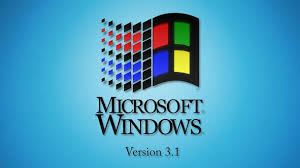
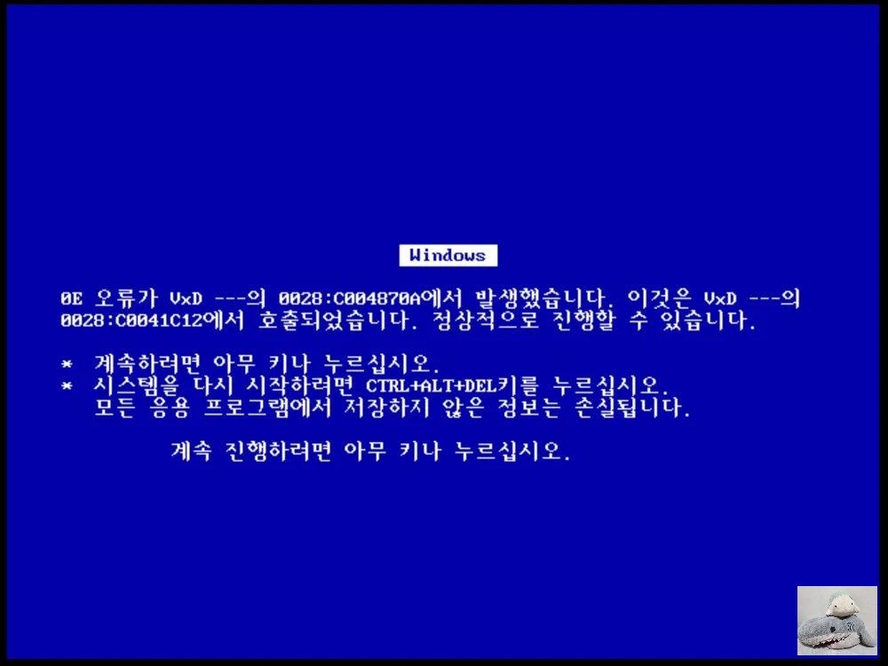
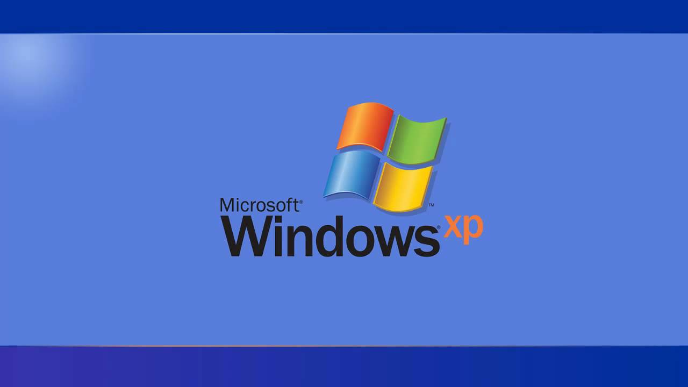
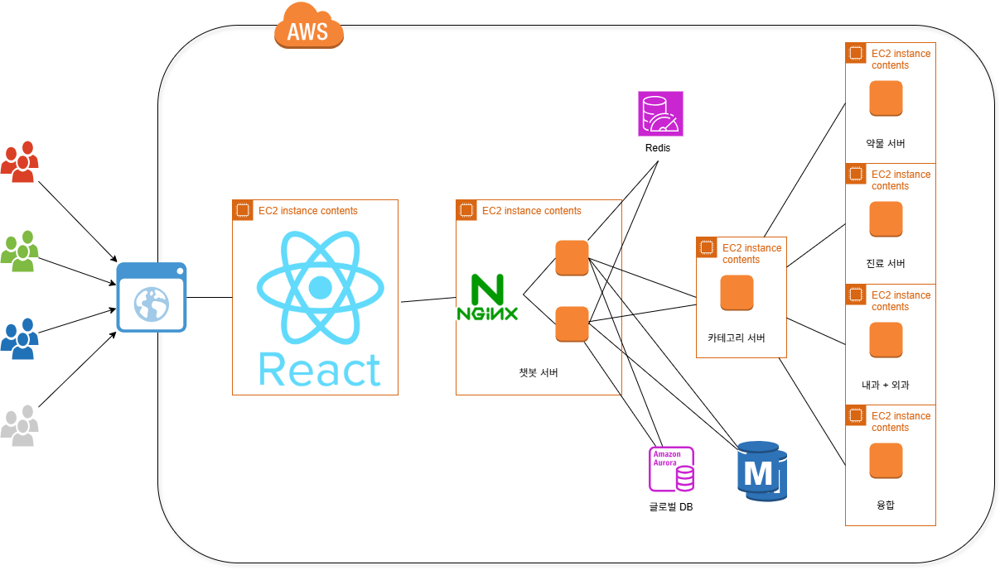

# SKN12-4th-5TEAM
## 프로젝트 : FastAPI 기반 LLM 연동 의료 서비스 서버

---

## 팀 소개
### 팀 명 : 윈도우즈
## 팀 멤버

|  |  |  |  |  |
|:--:|:--:|:--:|:--:|:--:|
| **권성호** | **남의헌** | **손현성** | **이준배** | **이준석** |

---

## 프로젝트 목적

#### 의료 관련 LLM 및 다양한 도메인(카테고리, 약품, 병원, 응급지원 등) 지식을 연동한 FastAPI 기반 웹 서버 개발  
#### 템플릿 시스템과 서비스 초기화 구조를 통해 확장성과 유지보수성을 높인 의료 QA/상담 챗봇 백엔드 구현

---

## 산출물

- [요구사항 정의서](./산출물/요구사항%20정의서.hwp)
- [화면설계서](./산출물/화면%20설계서.pdf)
- [테스트 계획 및 결과 보고서](./산출물/테스트계획%20및%20결과보고서.pdf)
- [시스템 구성도](./산출물/5조%20시스템%20아키텍처%20및%20구성도.pdf)

---

## 기술 스택

**백엔드**  
  

**데이터/캐시/메시지큐**  
  

**LLM & RAG**  
 

**프론트엔드**  


**클라우드/인프라**  


**개발 환경**  


---

## 시스템 구성도



- **FastAPI 서버**: 각 도메인별(카테고리, 약품, 병원, 응급지원 등) 라우터 및 템플릿 구조로 설계
- **서비스 레이어**: DB, 캐시, 이벤트, 메시지큐, 빌링 등 서비스 모듈화
- **LLM 연동**: LangChain, OpenAI 등 다양한 LLM 및 임베딩/검색 연동
- **프론트엔드**: React 기반 웹앱

---

## 주요 기능

### 1. 앱 시작 시 초기화
- 로거 설정
- 템플릿 등록 및 초기화
- 서비스 초기화 (데이터베이스, 캐시, 이벤트, 메시지큐, 빌링)
- 설정 파일 로딩

### 2. 템플릿 시스템
- `BaseTemplate`: 모든 템플릿의 기본 클래스
- `TemplateContext`: 템플릿 관리 및 라이프사이클 관리
- 각 도메인별 템플릿 구현체

### 3. 설정 관리
- 환경별 설정 파일 (`config.json`, `config_debug.json`)
- JSON 기반 설정 로딩
- 기본값 폴백 지원

---

## 설치 및 실행

### 1. 의존성 설치
```bash
pip install -r requirements.txt
```

### 2. 설정 파일 준비
- `config.json` 또는 `config_debug.json` 파일을 프로젝트 루트에 배치
- 환경 변수 `DEBUG=true`로 설정하면 디버그 설정 파일 사용

### 3. 서버 실행
```bash
# 개발 모드
DEBUG=true python application/chatbot_server/main.py

# 프로덕션 모드
python application/chatbot_server/main.py
```

또는 uvicorn 직접 사용:
```bash
uvicorn application.chatbot_server.main:app --host 0.0.0.0 --port 8000 --reload
```

---

## API 엔드포인트

- `GET /`: 서버 상태 확인
- `GET /health`: 헬스 체크
- `GET /docs`: Swagger UI (FastAPI 자동 생성)

---

## 템플릿 추가 방법

1. `template/base/template_type.py`에 새로운 템플릿 타입 추가
2. `template/[domain]/[domain]_template_impl.py` 생성
3. `BaseTemplate` 상속하여 구현
4. `main.py`의 `TemplateStartup.run()`에서 템플릿 등록

---

## 서비스 구현

현재 주석 처리된 서비스들을 실제 구현하려면:

1. `service/` 디렉토리에 각 서비스 모듈 생성
2. `main.py`에서 주석 해제
3. 해당 서비스의 초기화 로직 구현

---

## 설정 파일 구조

```json
{
  "databaseConfig": {
    "firestoreProductId": "project-id",
    "firestorePrivateKey": "private-key",
    "tables": {}
  },
  "cacheConfig": {
    "host": "localhost",
    "port": 6379,
    "sessionExpireTime": 3600
  },
  "eventConfig": {
    "enabled": true,
    "eventQueue": "events"
  },
  "messageQueueConfig": {
    "host": "localhost",
    "port": 5672,
    "username": "guest",
    "password": "guest"
  },
  "billingConfig": {
    "enabled": false,
    "provider": "none"
  },
  "templateConfig": {
    "gameId": "fastapi-base-server",
    "env": "development"
  }
}
```

---

## 팀원 한줄 소감 ✨

| 이름 | 소감 |
|------|------|
| **권성호** | 포기하려 했지만 팀원들 덕분에 끝까지 프로젝트를 완수했습니다. 모드 고생하셨습니다.!!. |
| **남의헌** | 서버에 대한 지식을 많이 배워갈 수 있는 시간이었습니다. 팀원들 모두 고생하셨습니다!! |
| **이준배** | 다들 포기하지 않고 끝까지 노력한 덕분에 완성할 수 있었습니다. 저에게도 뿌듯하고 다들 감사합니다. |
| **이준석** | 많이 부족했는데, 다들 많이 신경써주셔서 성공적으로 끝낼 수 있었습니다. 감사합니다. |
| **손현성** | 이슈가 있었는데 팀원분들 덕분에 프로젝트가 잘 마무리 된 것 같습니다. 팀원분들께 감사합니다. 진짜 진짜 고생하셨습니다. |
