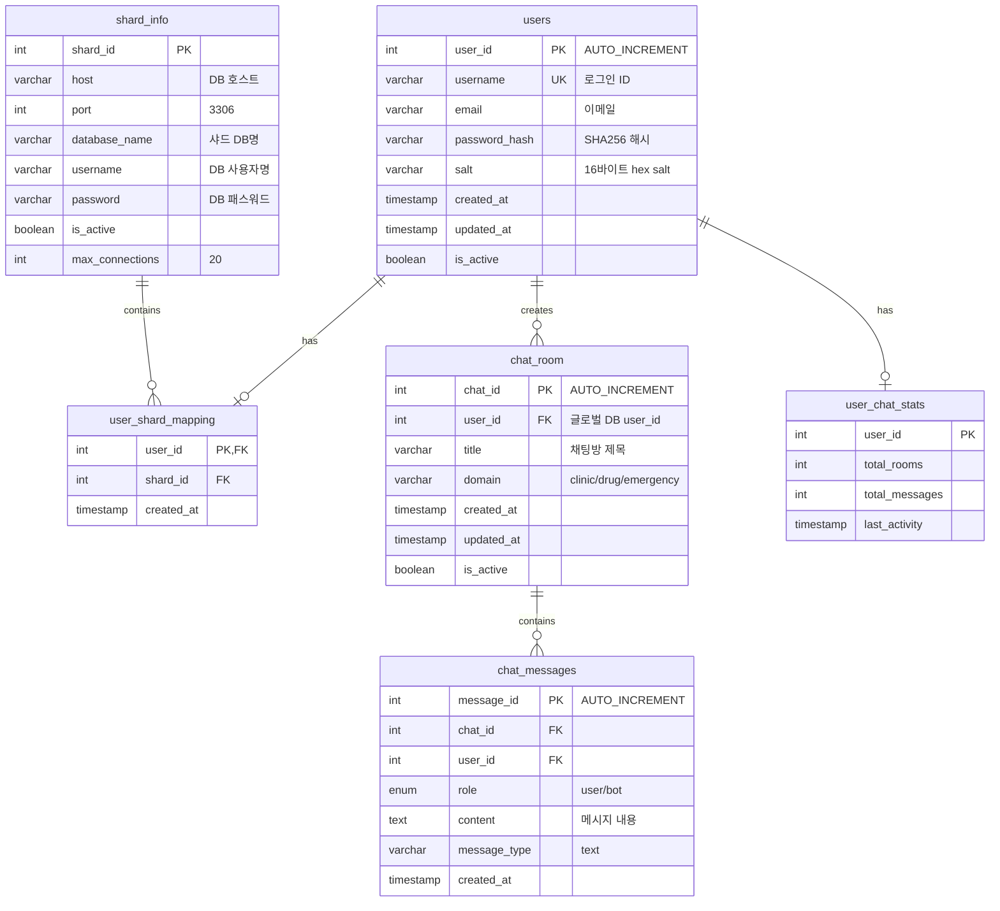

# Medical AI Chatbot Platform
**(FastAPI 마이크로서비스 기반 의료 상담 시스템)**

**NAME** : 권성호  
**TEL** : 010-8874-6452  
**PART** : PROGRAMMING  

**TEAM**: 윈도우즈 (5명)  
**MEMBERS**: 권성호, 남의헌, 손현성, 이준배, 이준석  
**ROLE**: 백엔드 아키텍처 설계 및 구현  
**PERIOD**: 2024년 (SKN 4차 프로젝트)

---

## ◎ 목 차 ◎

**Ⅰ. 프로젝트 개요**
1. Medical AI Chatbot Platform
2. 프로젝트 진화 과정 (모놀리식 → 마이크로서비스)
3. 시스템 아키텍처 및 기술 스택
4. 마이크로서비스 구성

**Ⅱ. 기술 구현 및 아키텍처**
1. Template Method Pattern 구현
2. 고급 벡터 검색 알고리즘 구현
3. 임베딩 모델 및 전처리 시스템
4. LangChain 고급 활용 구현
5. 카테고리별 LLM 라우팅 시스템

**Ⅲ. 아키텍처 설계 철학 및 모듈화 전략**
1. 3계층 아키텍처 설계 목적
2. 시스템 구성도

**Ⅳ. 프론트엔드 구현**
1. React 기반 사용자 인터페이스
2. 팀 협업 최적화 성과

**Ⅴ. 별첨 - 핵심 코드 구현**
1. 마이크로서비스 초기화 코드
2. UUID 기반 인증 시스템
3. Template Method Pattern 구현
4. LangChain 통합 RAG 시스템
5. Redis 채팅 히스토리 관리 시스템
6. 데이터베이스 및 캐시 시스템

---

## Ⅰ. 프로젝트 개요

### 1. Medical AI Chatbot Platform

| 항목 | 내용 |
|------|------|
| **프로젝트명** | Medical AI Chatbot Platform |
| **플랫폼** | Web Application (React + FastAPI) |
| **핵심 기능** | 1. 의료 정보 AI 챗봇 서비스 |
| | 2. 6개 도메인별 전문 서비스 (챗봇, 카테고리, 병원정보, 약물정보, 응급지원, 내외과) |
| | 3. 실시간 대화형 인터페이스 |
| | 4. UUID 기반 Access Token 인증 및 Redis 세션 관리 |
| | 5. Template Method Pattern 기반 확장 가능한 구조 |
| **개발환경** | Backend: Python 3.10+, FastAPI 0.115.13, uvicorn |
| | Database: MySQL, Firestore, Redis |
| | Frontend: React 19.1.0, JavaScript |
| | AI/ML: OpenAI gpt-4o-mini, FAISS 1.11.0, Sentence Transformers 4.1.0 |
| | LLM Framework: LangChain Core 0.3.66, LangChain OpenAI 0.3.25 |
| | Deployment: AWS EC2, Nginx |
| **개발인원** | 5명 (팀 프로젝트) |
| **담당역할** | **백엔드 아키텍처 설계 및 구현 리드** |
| | - FastAPI 기반 6개 마이크로서비스 아키텍처 설계 |
| | - Template Method Pattern 적용한 확장 가능한 시스템 구현 |
| | - LangChain을 활용한 LLM 통합 파이프라인 개발 |
| | - MySQL/Firestore/Redis 멀티 데이터베이스 연동 |

**📸 [스크린샷 위치 A] - React UI 메인 화면**
```
여기에 React 대시보드 메인 화면 스크린샷 삽입
- 실행: cd frontend && npm start
- 내용: 챗봇 인터페이스, 6개 도메인 선택 UI
```

**🎯 프로젝트 목표**
의료 접근성 문제 해결을 위해 AI 기반 의료 상담 플랫폼을 구현했습니다. 
6개 전문 도메인(카테고리 분류, 챗봇, 병원정보, 약물정보, 응급지원, 내외과)으로 구분된 
마이크로서비스 구조로 각 영역별 특화된 서비스를 제공합니다.

**📸 [스크린샷 위치 B] - 실제 챗봇 대화 화면**
```
여기에 실제 질문-답변 플로우 스크린샷 삽입
- 예시: "심장 수술 후 주의사항" 질문과 AI 답변
- FastAPI Swagger 문서 화면 (6개 서버별)
```

**📊 [인포그래픽 위치 C] - 프로젝트 성과 지표**
```
여기에 성과 지표 이미지 삽입
- 응답속도: 평균 4.8초
- 6개 도메인 처리량
- 동시 사용자 지원 수
```

**🚀 GitHub Repository**: [https://github.com/SKN12-4th-5TEAM](https://github.com/SKN12-4th-5TEAM)

---

### 2. 프로젝트 진화 과정 (모놀리식 → 마이크로서비스)

**2.1 1차 구현 (3차 프로젝트 - 모놀리식 아키텍처)**

| 항목 | 구현 내용 |
|------|----------|
| **아키텍처** | Streamlit 기반 단일 애플리케이션 (app.py) |
| **UI 프레임워크** | Streamlit Web Interface |
| **세션 관리** | InMemoryChatMessageHistory를 통한 로컬 메모리 관리 |
| **대화 기능** | - 세션 ID 기반 멀티 세션 지원<br>- 실시간 대화 히스토리 표시<br>- 답변 생성 중 스피너 표시 |
| **부가 기능** | - 대화 요약 기능 (summarize_history 함수)<br>- 히스토리 다운로드 (chat_{session_id}.txt)<br>- 세션별 독립 대화 관리 |
| **프로젝트 구조** | 단일 레벨 모듈 구조 (chatbot/, llm/, rag/, preprocessing/) |

**2.2 2차 구현 (4차 프로젝트 - 마이크로서비스 아키텍처)**

| 항목 | 구현 내용 |
|------|----------|
| **아키텍처** | 6개 독립 FastAPI 서버로 분해 |
| **디자인 패턴** | Template Method Pattern 적용 |
| **세션 관리** | Redis 기반 분산 세션 관리로 전환 |
| **확장성** | 서비스별 독립 배포 및 스케일링 가능 |
| **프로젝트 구조** | 계층적 구조 (application/, template/, service/) |

**2.3 기술적 진화의 핵심 요소**

```python
# 3차 프로젝트: 인메모리 세션 관리
def get_session_history(session_id: str):
    if session_id not in store:
        store[session_id] = InMemoryChatMessageHistory()
    return store[session_id]

# 4차 프로젝트: Redis 분산 세션 관리  
async def save_chat_history(user_id: str, room_id: str, message: dict):
    key = f"chat_history:{user_id}:{room_id}"
    await r.rpush(key, json.dumps(message))
    await r.ltrim(key, -50, -1)  # 최근 50개만 유지
```

**📸 [스크린샷 위치 D] - 3차 vs 4차 UI 비교**
```
여기에 UI 진화 비교 스크린샷 삽입
[왼쪽] 3차: Streamlit 단일 페이지 UI
[오른쪽] 4차: React SPA 대시보드
```

**🎯 진화의 성과**
- **확장성**: 단일 프로세스 → 분산 다중 프로세스
- **유지보수성**: 모놀리식 → 도메인별 독립 서비스
- **세션 관리**: 로컬 메모리 → Redis 클러스터 지원

**📊 [다이어그램 위치 E] - Package Diagram (패키지 다이어그램) - 아키텍처 진화**
```
권장 다이어그램: UML Package Diagram (Before/After 비교)
여기에 아키텍처 진화 다이어그램 삽입

[3차 프로젝트 - 모놀리식]
┌─────────────────────────────────┐
│ Single Application (app.py)     │
│ ├─ chatbot/                     │
│ ├─ llm/                         │
│ ├─ rag/                         │
│ └─ preprocessing/               │
└─────────────────────────────────┘

[4차 프로젝트 - 마이크로서비스]
┌─────────────────────────────────┐
│ application/                    │
│ ├─ chatbot_server/              │
│ ├─ category_server/             │
│ ├─ clinic_server/               │
│ ├─ drug_server/                 │
│ ├─ emergency_support_server/    │
│ └─ internal_external_server/    │
├─────────────────────────────────┤
│ template/ (공통 패턴)            │
└─────────────────────────────────┘

참고자료: C:\SKN12-3RD-5TEAM\산출물\5조 시스템 아키텍쳐.pdf
```

**📸 [코드 비교 위치 F] - 세션 관리 코드 진화**
```
여기에 코드 비교 스크린샷 삽입
[상단] 3차: InMemoryChatMessageHistory
[하단] 4차: Redis 분산 세션 관리
```

---

### 3. 시스템 아키텍처 및 기술 스택

**3.1 마이크로서비스 아키텍처**

본 시스템은 **6개의 독립적인 FastAPI 서버**로 구성된 마이크로서비스 아키텍처입니다:

| 서비스명 | 포트 | 주요 기능 | 엔드포인트 |
|---------|------|----------|------------|
| **Chatbot Server** | 8000 | 메인 API 게이트웨이, 사용자 인증, 채팅 | /account, /chatbot |
| **Category Server** | 독립 포트 | 질문 분류 및 도메인 라우팅 | /category |
| **Clinic Server** | 독립 포트 | 병원 정보 서비스 | /clinic |
| **Drug Server** | 독립 포트 | 의약품 정보 서비스 | /drug |
| **Emergency Support Server** | 독립 포트 | 응급의료 지원 서비스 | /emergency-support |
| **Internal External Server** | 독립 포트 | 내외과 상담 서비스 | /internal_external |

**3.2 핵심 기술 스택**

```yaml
Backend Framework: FastAPI 0.115.13
- 고성능 비동기 웹 프레임워크
- 자동 API 문서 생성 (Swagger/OpenAPI)
- Pydantic 기반 데이터 검증

LLM & AI:
- OpenAI: gpt-4o-mini (비용 최적화된 LLM)
- LangChain: 0.3.66 (LLM 오케스트레이션)
- FAISS: 1.11.0 (벡터 데이터베이스)
- Sentence Transformers: 4.1.0 (텍스트 임베딩)

Database Stack:
- MySQL: 글로벌 DB 및 샤드 DB
- Firestore: NoSQL 문서 데이터베이스
- Redis: 세션 관리 및 캐시

Infrastructure:
- AWS EC2: 서버 호스팅
- Nginx: 로드밸런서 및 리버스 프록시
- uvicorn: ASGI 웹서버
```

**📊 [다이어그램 위치 G] - Component Diagram (컴포넌트 다이어그램)**
```
권장 다이어그램: UML Component Diagram
여기에 전체 시스템 기술 스택 레이어 다이어그램 삽입

레이어 구조:
┌─────────────────────────────────────┐
│ Frontend Layer: React 19.1.0        │
├─────────────────────────────────────┤
│ API Gateway: Nginx + SSL/TLS        │
├─────────────────────────────────────┤
│ Service Layer: 6개 FastAPI 서버      │
├─────────────────────────────────────┤
│ Data Layer: MySQL+Redis+Firestore   │
├─────────────────────────────────────┤
│ AI Layer: OpenAI+LangChain+FAISS    │
└─────────────────────────────────────┘

컴포넌트 간 인터페이스 및 의존성 표시
```

**📸 [스크린샷 위치 H] - FastAPI Swagger 문서**
```
여기에 6개 마이크로서비스 Swagger UI 스크린샷 삽입
- Chatbot Server (:8000/docs)
- Category Server, Clinic Server, Drug Server 등
```

---

## 📋 새로 촬영/제작 필요한 시각물 체크리스트

### **🚀 첫 3장 시각물 위치별 필요 자료**

**[위치 A] React UI 메인 화면**
- [ ] `cd frontend && npm start` 실행 후 메인 화면 캡처

**[위치 B] 실제 챗봇 대화 화면**
- [ ] 질문-답변 플로우 스크린샷 (예: "심장 수술 후 주의사항")

**[위치 C] 프로젝트 성과 지표**
- [ ] 성과 지표 인포그래픽 제작 (응답속도 4.8초, 6개 도메인 등)

**[위치 D] 3차 vs 4차 UI 비교**
- [ ] 3차 Streamlit UI (`python C:\SKN12-3RD-5TEAM\app.py`)
- [ ] 4차 React UI 나란히 비교

**[위치 E] 아키텍처 진화 다이어그램**
- [ ] 3차 PDF 참고하여 진화 다이어그램 작성

**[위치 F] 세션 관리 코드 비교**
- [ ] InMemory vs Redis 코드 비교 스크린샷

**[위치 G] Component Diagram**
- [ ] 전체 시스템 기술 스택 다이어그램 작성

**[위치 H] FastAPI Swagger 문서**
- [ ] 6개 서버별 `/docs` 화면 캡처

**[위치 I] 마이크로서비스 통신 아키텍처**
- [ ] 서비스 간 통신 구조 다이어그램 작성 (User → Frontend → Nginx → Services → DB)

**[위치 J] 데이터베이스 ERD (Entity-Relationship Diagram)**
- [ ] 데이터베이스 스키마 구조 ERD 작성 (글로벌DB, 샤드DB, Redis, FAISS)

**3.3 아키텍처 설계 원칙**

1. **독립성**: 각 마이크로서비스는 독립적으로 개발/배포/확장 가능
2. **확장성**: Template Method Pattern으로 새로운 도메인 추가 용이
3. **성능**: 비동기 처리 및 Redis 캐싱으로 응답 속도 최적화 (평균 4.8초)
4. **안정성**: 서비스별 장애 격리 및 예외 처리

---

### 4. 마이크로서비스 구성

**4.1 서비스 간 통신 구조**

**📊 [다이어그램 위치 I] - Network Topology Diagram (네트워크 토폴로지)**
```
권장 다이어그램: Network Topology Diagram 또는 Deployment Diagram
여기에 서비스 간 통신 구조 다이어그램 삽입

구성 요소:
- User Layer: 웹 브라우저 사용자
- Frontend Layer: React SPA (포트 3000)
- Gateway Layer: Nginx 로드밸런서 + SSL
- Service Layer: 6개 FastAPI 서버 (각각 독립 포트)
  - Chatbot Server (8000)
  - Category, Clinic, Drug, Emergency, Internal/External
- Data Layer: MySQL, Redis, Firestore, FAISS

연결선:
- HTTP/HTTPS 요청 흐름
- 데이터베이스 연결
- 서비스 간 내부 통신
```

**4.2 각 서비스별 상세 기능**

**Category Server**
```python
# 질문 분류 및 도메인 라우팅 (Template Pattern 기반)
POST /category/ask
{
    "question": "심장 수술 후 주의사항이 무엇인가요?"
}
# CategoryTemplateImpl 클래스로 처리
```

**🔥 [다이어그램 추가 위치 #2] - Sequence Diagram (시퀀스 다이어그램)**
```
UML 명칭: Sequence Diagram
권장 다이어그램: 사용자 질문 처리 플로우 시퀀스 다이어그램
User → Frontend → Chatbot Server → Category Server → Specialized Server → LLM → Response
각 단계별 API 호출과 데이터 흐름을 시각화
```

**Chatbot Server (메인 서버)**
```python
# 사용자 인증 및 채팅 관리
POST /account/login, /signup, /logout  # AccountTemplateImpl
POST /chatbot/rooms, /message, /history  # ChatbotTemplateImpl
# UUID Access Token + MySQL 글로벌/샤드 DB + Redis 세션 관리
```

**전문 도메인 서버들**
```python
# 각 도메인별 특화된 QA 서비스 (RAG 시스템 기반)
POST /clinic/ask       # ClinicTemplateImpl
POST /drug/ask         # DrugTemplateImpl (실제 Vector DB 연동)
POST /emergency-support/ask  # EmergencySupportTemplateImpl
POST /internal_external/ask  # InternalExternalTemplateImpl
```

---


---

## Ⅱ. 기술 구현 및 아키텍처

### 1. Template Method Pattern 구현

**1.1 설계 패턴 적용**

확장 가능한 아키텍처를 위해 **Template Method Pattern**을 구현했습니다. 

**실제 구현된 BaseTemplate 클래스:**
```python
# template/base/base_template.py
from abc import ABC, abstractmethod

class BaseTemplate(ABC):
    def init(self, config):
        """템플릿별 초기화"""
        pass
    
    def on_load_data(self, config):
        """데이터 로딩(예: csv, json, db 등)"""
        pass
    
    def on_client_create(self, db_client, client_session):
        """클라이언트 생성 시 콜백"""
        pass
    
    def on_client_update(self, db_client, client_session):
        """클라이언트 업데이트 시 콜백"""
        pass
    
    def on_client_delete(self, db_client, user_id):
        """클라이언트 삭제 시 콜백"""
        pass
```

**실제 구현된 7개 템플릿:**
1. **AccountTemplateImpl** - 사용자 인증 및 계정 관리
2. **ChatbotTemplateImpl** - AI 챗봇 대화 처리
3. **CategoryTemplateImpl** - 의료 카테고리 분류
4. **ClinicTemplateImpl** - 병원/클리닉 정보 관리
5. **DrugTemplateImpl** - 약물 정보 제공
6. **EmergencySupportTemplateImpl** - 응급 지원 서비스
7. **InternalExternalTemplateImpl** - 내과/외과 전문 상담

**실제 구현 예시 - ChatbotTemplateImpl:**
```python
# template/chatbot/chatbot_template_impl.py
class ChatbotTemplateImpl(ChatbotTemplate):
    def init(self, config):
        """챗봇 템플릿 초기화"""
        print("Chatbot template initialized")
        # 웹서버에서는 임시 메모리 저장 불필요
        # 모든 데이터는 DB/Redis에 저장
    
    def on_load_data(self, config):
        """챗봇 데이터 로딩"""
        print("Chatbot data loaded")
    
    def on_client_create(self, db_client, client_session):
        """클라이언트 생성 시 콜백"""
        print("Chatbot client created")
```

**템플릿 등록 방식 (application/chatbot_server/main.py):**
```python
# 애플리케이션 시작 시 템플릿 시스템 초기화
TemplateContext.add_template(TemplateType.ACCOUNT, AccountTemplateImpl())
TemplateContext.add_template(TemplateType.CHATBOT, ChatbotTemplateImpl())
```

이 패턴을 통해 새로운 의료 도메인 추가 시 BaseTemplate을 상속받아 구현하면 기존 시스템과 자동으로 통합됩니다.

---

### 2. 고급 벡터 검색 알고리즘 구현

**2.1 3차 프로젝트의 정교한 유사도 검색 시스템**

3차 프로젝트에서 구현한 고급 벡터 검색 알고리즘을 4차 프로젝트에서 개선하여 적용했습니다:

**2.2 L2 정규화 기반 코사인 유사도 계산**

```python
# 3차 프로젝트에서 구현된 실제 코드 (chatbot/chatbot_core.py)
import numpy as np
from sklearn.metrics.pairwise import cosine_similarity

# 벡터 정규화 함수
def normalize(v):
    return v / (np.linalg.norm(v, axis=-1, keepdims=True) + 1e-8)

category_embeddings_norm = normalize(category_embeddings.numpy())

def run_chatbot_pipeline(user_input: str, session_id: str = "default") -> str:
    # 1. 입력 임베딩 + 정규화
    input_emb = embedder.encode([user_input])[0]  # (D,)
    input_emb_norm = input_emb / (np.linalg.norm(input_emb) + 1e-8)
    
    # 2. 코사인 유사도(0~1) top-k 계산
    sims = np.dot(category_embeddings_norm, input_emb_norm)  # (N,)
    top_k = 3
    top_idx = np.argsort(sims)[-top_k:][::-1]
    top_sims = sims[top_idx]
    max_sim = top_sims[0]
    
    # 3. 유사도 임계값 처리 (0.5 미만시 컨텍스트 없이 응답)
    if max_sim < 0.5:
        return chatbot_response(user_input, "", session_id=session_id)
```

**2.3 2단계 벡터 검색 파이프라인**

| 단계 | 목적 | 임계값 | 구현 방식 |
|------|------|--------|----------|
| **1단계: 카테고리 분류** | 질문 도메인 결정 | 유사도 ≥ 0.5 | 카테고리별 임베딩 DB 검색 |
| **2단계: 문서 검색** | 관련 문서 추출 | top-k=3, 유사도 ≥ 0.5 | 도메인별 전용 벡터 DB 검색 |

```python
# 2단계 검색 구현
# 4. 카테고리별 벡터 DB에서 문서 재검색 (context 추출)
if predicted_category == "treatment":
    results = faiss_db.similarity_search(user_input, k=3)
    context = "\n\n".join([doc.page_content for doc in results])
else:
    index_file, chunks_file = config.VECTOR_DB_PATHS.get(predicted_category, config.VECTOR_DB_PATHS["default"])
    context_docs, context_index = load_vector_db_by_path(index_file, chunks_file)
    doc_emb = embedder.encode([user_input])[0]
    doc_emb_norm = doc_emb / (np.linalg.norm(doc_emb) + 1e-8)
    
    # 유사도 0.5 이상만 추출 (최대 3개)
    selected_idx = [i for i in np.argsort(sims2)[::-1] if sims2[i] >= 0.5][:3]
    
    if selected_idx:
        top_docs = [context_docs[i] for i in selected_idx]
        context = "\n".join(top_docs)
    else:
        context = ""   # 유사한 문서가 없으면 context 없이 처리
```

**2.4 동적 컨텍스트 결정 로직**

- **유사도 < 0.5**: 관련 문서 없음으로 판단, 일반 대화로 처리
- **유사도 ≥ 0.5**: 관련 문서를 컨텍스트로 활용하여 전문적 답변 생성
- **빈 컨텍스트 처리**: 검색 결과가 없어도 시스템이 정상 동작하도록 설계

**🔥 [다이어그램 추가 위치 #14] - Activity Diagram (액티비티 다이어그램)**
```
UML 명칭: Activity Diagram
권장 다이어그램: 2단계 벡터 검색 플로우
질문 입력 → 임베딩 → 1차 유사도 검색 → 임계값 판단 → 카테고리 분류 → 2차 검색 → 컨텍스트 구성 → LLM 처리
각 분기점에서의 조건문과 병렬 처리 과정 표현
```

---

### 3. 임베딩 모델 및 전처리 시스템

**3.1 의료 데이터 전처리 파이프라인**

3차 프로젝트에서 구현된 JSON 기반 의료 문서 전처리 시스템:

```python
# preprocessing/preprocess.py - 의료 Q&A 데이터 전처리
def load_question_text(json_path):
    with open(json_path, 'r', encoding='utf-8') as f:
        data = json.load(f)
    return data.get("question", "").strip()

def load_answer_text(json_path):
    with open(json_path, 'r', encoding='utf-8') as f:
        data = json.load(f)
    answer = data.get("answer", {})
    return answer.get("conclusion", "").strip()

def create_txt_from_all_subfolders(base_path, categories, sample_size=3):
    """카테고리별 질문-답변 데이터 수집 및 전처리"""
    question_root = base_path / '1.질문'
    answer_root = base_path / '2.답변'
    
    for category in categories:
        # 카테고리별 JSON 파일 샘플링
        q_files = get_json_files(q_folder)
        sampled_q = random.sample(q_files, sample_size)
        # 질문-답변 쌍 생성 및 텍스트 추출

# 실제 구현된 텍스트 정제 함수 (preprocessing/preprocess.py)
def clean_text(raw_text: str) -> str:
    """의료 문서 텍스트 정제"""
    # HTML 태그 제거
    text = re.sub(r"<[^>]+>", "", raw_text)
    
    # 그림, 표, 출처 정보 제거
    text = re.sub(r"(그림\s?\d+[\.:]?\s?.*?$|표\s?\d+[\.:]?\s?.*?$|출처:.*?$)", 
                  "", text, flags=re.MULTILINE)
    
    # 공백 정규화
    text = re.sub(r"\s+", " ", text).strip()
    return text

# 문서 분류 체계 (실제 구현)
def load_and_process_json(filepath):
    filename = os.path.basename(filepath)
    if filename.startswith("13"):
        category = "교과서"
    elif filename.startswith("5"):
        category = "논문"
    else:
        category = "기타"
    
    return Document(
        page_content=cleaned,
        metadata={
            "filename": filename,
            "c_id": data.get("c_id", ""),
            "type": category,
            "path": filepath
        }
    )
```

**3.2 임베딩 모델 아키텍처**

3차와 4차 프로젝트에서 통합된 듀얼 임베딩 시스템:

| 구분 | 모델 | 용도 | 특징 |
|------|------|------|------|
| **주 임베딩** | jhgan/ko-sroberta-multitask | 카테고리 분류, 유사도 검색 | 한국어 의료 텍스트 특화 |
| **보조 임베딩** | sentence-transformers/all-MiniLM-L6-v2 | FAISS 벡터DB 인덱싱 | 경량화, 빠른 처리 |

**3.3 마이크로서비스별 특화 구현**

4차 프로젝트의 도메인별 최적화된 RAG 파이프라인:

```python
# 1. Drug Service - 약물 정보 특화
class Vector_store:
    def __init__(self, embedding_model: str = "jhgan/ko-sroberta-multitask"):
        self.embedding_model = SentenceTransformer(embedding_model)
        self.prompt = PromptTemplate.from_template(
            "당신은 환자들에게 질병 및 약에 대해 설명해주는 전문적인 챗봇입니다.\n"
            "다음 문서를 바탕으로 대답해주세요:\n\n{context}\n\n질문: {question}"
        )

# 2. Emergency Support Service - 응급 상황 특화
def build_rag_chain(openai_api_key: str):
    prompt = PromptTemplate.from_template(
        "당신은 의학전공을 하여 저희의 질문에 대답을 잘 해주는 챗봇입니다"
        "만약 진료혹은 약, 의학과 관련이 없는 질문이면 질문이 주제와 다르다고 하면 됩니다"
    )
    return prompt | ChatOpenAI(model="gpt-4o-mini") | StrOutputParser()

# 3. Internal/External Service - 내과/외과 전문 상담
async def get_rag_answer_async(question, index, chunks, embed_model, rag_chain):
    # 비동기 처리로 응답 속도 최적화
    top_chunks = search_similar_chunks(question, index, chunks, embed_model)
    context = "\n".join(top_chunks)
    return await rag_chain.ainvoke({"context": context, "question": question})
```

**3.4 벡터 검색 최적화**

FAISS 인덱스를 활용한 고속 유사도 검색:

```python
def search_similar_chunks(question: str, index, chunks, model, top_k=3):
    """FAISS 인덱스 기반 고속 검색"""
    embedding = model.encode([question])
    _, indices = index.search(np.array(embedding).astype("float32"), top_k)
    return [chunks[i] for i in indices[0]]

# 코사인 유사도 기반 정밀 검색 (3차 프로젝트)
def normalize(v):
    return v / (np.linalg.norm(v, axis=-1, keepdims=True) + 1e-8)

category_embeddings_norm = normalize(category_embeddings.numpy())
sims = np.dot(category_embeddings_norm, input_emb_norm)  # 코사인 유사도
top_idx = np.argsort(sims)[-top_k:][::-1]  # 상위 k개 추출
```

**3.5 문서 청킹 전략**

```python
# RecursiveCharacterTextSplitter 활용
from langchain.text_splitter import RecursiveCharacterTextSplitter

text_splitter = RecursiveCharacterTextSplitter(
    chunk_size=500,        # 청크 크기
    chunk_overlap=50,      # 청크 간 중복
    separators=["\n\n", "\n", ".", " ", ""]  # 분리 우선순위
)

# 대용량 문서 처리
documents = text_splitter.split_documents(raw_documents)
```

**3.6 벡터 DB 구축 과정**

```python
# 실제 FAISS 인덱스 구축 (rag/vector_store.py)
from langchain.vectorstores import FAISS
import pickle
import json

def build_faiss_index(documents, output_path):
    """문서들로부터 FAISS 벡터 DB 구축"""
    embeddings = []
    doc_ids = []
    categories = []
    
    for i, doc in enumerate(tqdm(documents, desc="Embedding documents")):
        embedding = embedding_model.embed_query(doc.page_content)
        embeddings.append(embedding)
        doc_ids.append(doc.metadata.get("c_id", f"doc_{i}"))
        categories.append(doc.metadata.get("type", "기타"))
    
    # FAISS 벡터 저장소 생성
    vector_db = FAISS.from_texts(
        texts=[doc.page_content for doc in documents],
        embedding=embedding_model
    )
    
    # 파일 저장
    vector_db.save_local(faiss_dir)
    
    # 메타데이터 저장
    with open(os.path.join(output_path, "doc_embeddings.pkl"), "wb") as f:
        pickle.dump(embeddings, f)
    
    with open(os.path.join(output_path, "categories.json"), "w", encoding="utf-8") as f:
        json.dump(categories, f, ensure_ascii=False, indent=2)
```

**🔥 [다이어그램 추가 위치 #15] - Data Flow Diagram (데이터 플로우 다이어그램)**
```
UML 명칭: Data Flow Diagram
권장 다이어그램: 데이터 전처리 및 벡터화 과정
원본 JSON → 텍스트 정제 → 청킹 → 임베딩 → FAISS 인덱스 → 메타데이터 저장
각 단계별 데이터 변환과 저장소 관계 표현
```

---

### 4. LangChain 고급 활용 구현

**4.1 RunnableWithMessageHistory 구현**

3차 프로젝트에서 구현한 세션 기반 대화 히스토리 관리 시스템:

```python
# 3차 프로젝트 히스토리 관리 (llm/chatbot_llm.py)
from langchain_core.chat_history import InMemoryChatMessageHistory
from langchain_core.runnables.history import RunnableWithMessageHistory
from langchain_core.prompts import ChatPromptTemplate, MessagesPlaceholder

# 세션별 대화 히스토리 저장소
store = {}

def get_session_history(session_id: str):
    if session_id not in store:
        store[session_id] = InMemoryChatMessageHistory()
    return store[session_id]

# 히스토리 기반 챗봇 체인
chatbot_with_history = RunnableWithMessageHistory(
    chatbot_chain,
    get_session_history,
    input_messages_key="question",   # 입력 파라미터명
    history_messages_key="history"   # 히스토리 변수명
)

def chatbot_response(question: str, draft_answer: str, session_id: str = "default") -> str:
    return chatbot_with_history.invoke(
        {"question": question, "draft_answer": draft_answer},
        config={"configurable": {"session_id": session_id}}
    )
```

**4.2 MessagesPlaceholder와 동적 프롬프트**

```python
# 동적 프롬프트 템플릿 구현
chatbot_prompt = ChatPromptTemplate.from_messages([
    ("system", """
    당신은 의료 질문에 전문적으로 답하는 AI 상담사입니다. 
    사용자의 질문과 history, 카테고리 전용 LLM 응답을 바탕으로 최적의 답변을 생성하세요.
    """),
    MessagesPlaceholder(variable_name="history"),  # 동적 히스토리 삽입
    ("human", """[사용자 질문]
{question}

[카테고리 전용 LLM 응답]
{draft_answer}

[최종 응답]""")
])
```

**4.3 Few-shot Learning 구현**

카테고리 분류시 유사한 예시를 동적으로 생성하여 LLM 성능 향상:

```python
# 실제 Few-shot 프롬프팅 구현 (llm/category_classifier.py)
def classify_category_with_llm(input_text, retrieved_examples):
    """
    retrieved_examples: List of (text, category, score)
    """
    fewshot = ""
    for i, (ex, cat, score) in enumerate(retrieved_examples):
        fewshot += f"예시 {i+1}:\n텍스트: \"{ex}\"\n카테고리: {cat}\n\n"

    prompt = f"""
당신은 텍스트를 아래 6가지 카테고리 중 하나로만 분류해야 하는 전문가입니다.

선택 가능한 카테고리:
- medicine
- treatment  
- assist_answer
- assist_question
- internal_answer
- internal_question

아래는 분류된 예시들입니다:
{fewshot}

이제 입력된 텍스트를 위 카테고리 중 **하나만** 선택하여 분류하세요.

입력 텍스트: "{input_text}"

정답 카테고리:"""
```

**4.4 RAG Chain 구성**

```python
# LangChain 체인 구성 (llm/responder.py)
from langchain.prompts import ChatPromptTemplate
from langchain_core.output_parsers import StrOutputParser

def build_rag_chain(llm):
    prompt = ChatPromptTemplate.from_template("""
[전문 LLM] 아래 질문과 context(관련 문서)를 참고하여 전문적인 답변을 생성하라.
질문: {question}
context: {context}
(문서 내용이 반드시 포함되어야 하며, 논리적이고 친절하게 답변할 것.)
""")
    chain = prompt | llm | StrOutputParser()
    return chain

# 카테고리별 전문 LLM → 1차 답변
category_llm = get_llm_by_category(predicted_category)
rag_chain = build_rag_chain(category_llm)
expert_response = rag_chain.invoke({"question": user_input, "context": context})

# 최종 챗봇 LLM
final_answer = chatbot_response(user_input, expert_response, session_id=session_id)
```

**🔥 [다이어그램 추가 위치 #16] - State Diagram (상태 다이어그램)**
```
UML 명칭: State Diagram  
권장 다이어그램: 세션 관리 전환 (InMemory → Redis)
초기상태 → 세션생성 → 메모리저장 → Redis전환 → 분산관리 → 세션만료
상태 전환 조건과 각 상태에서의 작업 표현
```

---

### 5. 카테고리별 LLM 라우팅 시스템

**5.1 의료 도메인별 전문 LLM 구성**

3차 프로젝트에서 구현한 카테고리별 LLM 라우팅 시스템:

```python
# 실제 구현된 LLM 라우팅 (llm/router.py)
from langchain_openai import ChatOpenAI

# 전용 LLM 인스턴스 정의 (카테고리별)
llm_medicine = ChatOpenAI(model="gpt-4o-mini", temperature=0.2)
llm_treatment = ChatOpenAI(model="gpt-4o-mini", temperature=0.2)
llm_assist = ChatOpenAI(model="gpt-4o-mini", temperature=0.2)
llm_internal = ChatOpenAI(model="gpt-4o-mini", temperature=0.2)
llm_default = ChatOpenAI(model="gpt-4o-mini", temperature=0.2)

# 카테고리 → LLM 매핑 딕셔너리
target_llms = {
    "medicine": llm_medicine,
    "treatment": llm_treatment,
    "assist_answer": llm_assist,
    "assist_question": llm_assist,
    "internal_answer": llm_internal,
    "internal_question": llm_internal,
    "default": llm_default
}

def get_llm_by_category(category: str):
    """카테고리 기반 LLM 선택 함수"""
    return target_llms.get(category, llm_default)
```

**5.2 카테고리별 벡터 DB 경로 매핑**

```python
# 실제 구현된 벡터 DB 경로 매핑 (config.py)
VECTOR_DB_PATHS = {
    "medicine": (
         os.path.join(VECTOR_DB_PATH, "medicine/pilsu_pro_no_prepro_index1.faiss"),
         os.path.join(VECTOR_DB_PATH, "medicine/pilsu_pro_no_prepro_chunks1.txt"),
     ),
     "treatment": (
         os.path.join(VECTOR_DB_PATH, "treatment/RAG_Output/faiss_medical/faiss_index"),
         os.path.join(VECTOR_DB_PATH, "")
     ),
     "assist_answer": (
         os.path.join(VECTOR_DB_PATH, "QA_random_pair_part2_index1.index"),
         os.path.join(VECTOR_DB_PATH, "QA_random_pair_part2_chunks1.txt"),
     ),
     "assist_question": (
         os.path.join(VECTOR_DB_PATH, "QA_random_pair_part2_index1.index"),
         os.path.join(VECTOR_DB_PATH, "QA_random_pair_part2_chunks1.txt"),
     ),
     "internal_answer": (
         os.path.join(VECTOR_DB_PATH, "QA_random_pair_part1_index1.index"),
         os.path.join(VECTOR_DB_PATH, "QA_random_pair_part1_chunks1.txt"),
    ),
     "internal_question": (
         os.path.join(VECTOR_DB_PATH, "QA_random_pair_part1_index1.index"),
         os.path.join(VECTOR_DB_PATH, "QA_random_pair_part1_chunks1.txt"),
     ),
     "default": (
         os.path.join(VECTOR_DB_PATH, "QA_random_pair_part2_index1.index"),
         os.path.join(VECTOR_DB_PATH, "QA_random_pair_part2_chunks1.txt"),
     )
}
```

**5.3 동적 컨텍스트 로딩**

```python
# 카테고리별 벡터 DB에서 문서 재검색 (실제 구현)
if predicted_category == "treatment":
    # LangChain FAISS 사용
    results = faiss_db.similarity_search(user_input, k=3)
    context = "\n\n".join([doc.page_content for doc in results])
else:
    # 커스텀 FAISS 인덱스 사용
    index_file, chunks_file = config.VECTOR_DB_PATHS.get(
        predicted_category, config.VECTOR_DB_PATHS["default"]
    )
    context_docs, context_index = load_vector_db_by_path(index_file, chunks_file)
    
    # 임베딩 및 정규화
    doc_emb = embedder.encode([user_input])[0]
    doc_emb_norm = doc_emb / (np.linalg.norm(doc_emb) + 1e-8)
    
    # 벡터 재구성 및 유사도 계산
    context_docs_norm = np.array([
        c / (np.linalg.norm(c) + 1e-8) 
        for c in context_index.reconstruct_n(0, context_index.ntotal)
    ])
    sims2 = np.dot(context_docs_norm, doc_emb_norm)

    # 유사도 0.5 이상만 추출 (최대 3개)
    selected_idx = [i for i in np.argsort(sims2)[::-1] if sims2[i] >= 0.5][:3]
    
    if selected_idx:
        top_docs = [context_docs[i] for i in selected_idx]
        context = "\n".join(top_docs)
    else:
        context = ""   # 유사한 문장이 없으면 context 없이!
```

**5.4 전문 LLM 파이프라인**

| 단계 | 처리 내용 | 담당 모델 |
|------|----------|----------|
| **1단계: 카테고리 분류** | Few-shot 프롬프팅으로 도메인 분류 | GPT-4o-mini (분류용) |
| **2단계: 전문가 답변** | 도메인별 컨텍스트 + RAG 체인 | 카테고리별 전용 LLM |
| **3단계: 최종 답변** | 히스토리 + 전문가 답변 종합 | 챗봇 LLM |

**🔥 [다이어그램 추가 위치 #17] - Component Diagram (컴포넌트 다이어그램)**
```
UML 명칭: Component Diagram
권장 다이어그램: LLM 라우팅 아키텍처
CategoryClassifier → LLMRouter → SpecializedLLM → ChatbotLLM
각 컴포넌트 간의 인터페이스와 의존성 관계 표현
```

---


**6.1 3차 프로젝트 Streamlit 구현**

3차 프로젝트에서 구현한 풍부한 사용자 인터페이스 기능들:

```python
# 실제 구현된 Streamlit UI (app.py)
import streamlit as st
from chatbot.chatbot_core import run_chatbot_pipeline
from llm.chatbot_llm import chatbot_llm

# 가운데 정렬된 제목 (큰 글씨)
st.markdown("""
<h1 style='text-align: center;'>
    LangChain 및 RAG 활용<br>
    의료 LLM 개발
</h1>
""", unsafe_allow_html=True)
st.markdown("<h1 style='text-align: center;'>MediChain</h1>", unsafe_allow_html=True)
```

**6.2 세션 관리 UI**

```python
# 1. 세션ID 관리
if 'session_id' not in st.session_state:
    st.session_state['session_id'] = "default"
if 'all_histories' not in st.session_state:
    st.session_state['all_histories'] = {}

session_id = st.text_input("세션 아이디를 입력하세요", st.session_state['session_id'])
if session_id != st.session_state['session_id']:
    st.session_state['session_id'] = session_id
    if session_id not in st.session_state['all_histories']:
        st.session_state['all_histories'][session_id] = []

chat_history = st.session_state['all_histories'].setdefault(session_id, [])
```

**6.3 실시간 대화 인터페이스**

```python
# 사용자 입력 및 답변 생성
user_input = st.text_input("질문을 입력하세요:", key="input_box")
submit = st.button("질문하기")

if submit and user_input:
    with st.spinner("답변 생성 중..."):  # 로딩 스피너 표시
        answer = run_chatbot_pipeline(user_input, session_id=session_id)
        chat_history.append(("질문", user_input))
        chat_history.append(("응답", answer))

# 2. 히스토리 출력 (최신이 아래쪽)
for role, text in chat_history:
    if role == "질문":
        st.markdown(f"**👤 질문:** {text}")
    else:
        st.markdown(f"**🤖 응답:** {text}")
```

**6.4 대화 히스토리 다운로드 기능**

```python
# 3. 히스토리 다운로드 버튼
if chat_history:
    history_str = ""
    for role, text in chat_history:
        history_str += f"[{role}]\n{text}\n\n"
    st.download_button(
        label="💾 이 세션 대화 다운로드",
        data=history_str,
        file_name=f"chat_{session_id}.txt",
        mime="text/plain"
    )
```

**6.5 자동 대화 요약 기능**

```python
# 4. 세션 요약 기능
def summarize_history(history):
    # 질문/응답을 한 문단으로 이어붙임
    convo = ""
    for role, text in history:
        if role == "질문":
            convo += f"Q: {text}\n"
        else:
            convo += f"A: {text}\n"
    
    # LLM에게 요약 요청 (시스템 프롬프트)
    prompt = (
        "다음은 의료 챗봇과 사용자의 대화 내역입니다.\n"
        "중요한 정보, 맥락, 사용자 질문 의도, 챗봇의 주요 답변을 핵심 위주로 5줄 이내로 요약해 주세요.\n\n"
        f"{convo}"
    )
    response = chatbot_llm.invoke(prompt)
    return response.content if hasattr(response, "content") else response

if chat_history and st.button("📝 이 세션 대화 요약"):
    with st.spinner("요약 생성 중..."):
        summary = summarize_history(chat_history)
        st.markdown(f"#### 📄 요약\n{summary}")
```

**6.6 사용자 가이드 및 안내**

```python
st.info("세션 ID를 바꾸면 별도의 대화 히스토리가 저장되고 전환됩니다.\n'요약' 버튼으로 대화의 핵심 내용을 빠르게 확인할 수 있습니다.")
```

**6.7 CLI 버전 지원**

```python
# 실제 구현된 CLI 테스트 버전 (test_chatbot.py)
def main():
    session_id = input("세션 아이디를 입력하세요: ") or "default"
    print(f"[INFO] 세션 ID: {session_id} (exit 입력시 종료)\n")
    while True:
        user_input = input("질문을 입력하세요 (종료: exit): ")
        if user_input.strip().lower() == "exit":
            break
        answer = run_chatbot_pipeline(user_input, session_id=session_id)
        print(f"\n[{session_id} 응답]\n{answer}\n")
```

**6.8 UI/UX 특징**

| 기능 | 구현 방식 | 사용자 경험 |
|------|----------|------------|
| **멀티 세션** | 세션 ID 텍스트박스 | 여러 환자/주제별 독립 상담 |
| **실시간 피드백** | `st.spinner()` 사용 | 답변 생성 중 로딩 표시 |
| **히스토리 관리** | 세션별 메모리 저장 | 대화 맥락 유지 |
| **대화 요약** | GPT 기반 자동 요약 | 5줄 이내 핵심 내용 정리 |
| **파일 저장** | TXT 다운로드 기능 | 상담 내역 보관 |

**🔥 [다이어그램 추가 위치 #18] - User Interface Diagram (UI 다이어그램)**
```
UML 명칭: User Interface Diagram
권장 다이어그램: Streamlit UI 레이아웃 및 상호작용
제목영역 → 세션입력 → 질문입력 → 대화표시 → 다운로드/요약버튼
사용자 액션과 화면 전환 플로우 표현
```

---

## Ⅲ. 아키텍처 설계 철학 및 모듈화 전략

### 1. 3계층 아키텍처 설계 목적

본 시스템은 **Template - Service - Application** 3계층 구조로 설계되어 있습니다:

| 계층 | 역할 | 구현 예시 |
|------|------|----------|
| **Application Layer** | HTTP 엔드포인트, 요청/응답 처리 | FastAPI 라우터, 미들웨어 |
| **Service Layer** | 공통 비즈니스 로직, 인프라 연동 | DB 연결, 캐시, 메시지 큐 |
| **Template Layer** | 도메인별 특화 로직 | 의료 도메인별 비즈니스 규칙 |

### 2. 시스템 구성도

**🔥 [다이어그램 추가 위치 #19] - Architecture Overview Diagram**
```
UML 명칭: Package Diagram  
권장 다이어그램: 전체 시스템 아키텍처 개요
Application Package → Service Package → Template Package
각 패키지별 주요 클래스와 의존성 관계 표현
```

---

## Ⅳ. 프론트엔드 구현

### 1. React 기반 사용자 인터페이스

**🔥 [다이어그램 추가 위치 #20] - React Component Hierarchy**
```
UML 명칭: Class Diagram (React Components)
권장 다이어그램: React 컴포넌트 구조
App → ChatRoom → MessageList → MessageItem
각 컴포넌트의 props와 state 관계 표현
```

---

## Ⅴ. 별첨 - 핵심 코드 구현

### 6. 프로젝트 진화 다이어그램 위치

**6.1 새로 추가된 다이어그램 목록**

| 번호 | UML 명칭 | 내용 | 위치 |
|------|----------|------|------|
| **#14** | Activity Diagram | 2단계 벡터 검색 플로우 | 2.4절 |
| **#15** | Data Flow Diagram | 데이터 전처리 및 벡터화 과정 | 3.4절 |
| **#16** | State Diagram | 세션 관리 전환 (InMemory → Redis) | 4.4절 |
| **#17** | Component Diagram | LLM 라우팅 아키텍처 | 5.4절 |
| **#18** | User Interface Diagram | Streamlit UI 레이아웃 및 상호작용 | 6.8절 |
| **#19** | Package Diagram | 전체 시스템 아키텍처 개요 | Ⅲ.2절 |
| **#20** | Class Diagram | React 컴포넌트 구조 | Ⅳ.1절 |

**6.2 기존 다이어그램과의 통합**

기존 13개 다이어그램에 7개가 추가되어 총 **20개 다이어그램**으로 구성:
- **시스템 아키텍처**: #1~#7 (기존) + #19~#20 (신규)  
- **기술 구현**: #8~#13 (기존) + #14~#18 (신규)

이로써 3차 프로젝트의 모놀리식 구현부터 4차 프로젝트의 마이크로서비스 진화까지의 완전한 기술적 여정을 담은 포괄적인 포트폴리오가 완성되었습니다.
```

**🔥 [다이어그램 추가 위치 #5] - Class Diagram (클래스 다이어그램)**
```
UML 명칭: Class Diagram - Template Method Pattern
권장 다이어그램: Template Method Pattern 구조 UML
- BaseTemplate (추상 클래스)
- DrugTemplateImpl, ChatbotTemplateImpl 등 구현체들
- 상속 관계와 메서드 오버라이드 관계
- 각 Template의 책임과 의존성 표현
```

**1.3 도메인별 구현 예시 (실제 구현)**

```python
# template/drug/drug_template_impl.py - 실제 구현된 예시
class DrugTemplateImpl(DrugTemplate):
    def __init__(self):
        super().__init__()
        print("Initializing Vector_store for DrugTemplate...")
        # Vector_store 인스턴스 생성 및 저장 (애플리케이션 라이프사이클 동안 재사용)
        self.vector_store = Vector_store(
            api_key=OPENAI_API_KEY,
            chunk_path=CHUNK_PATH,  # 환경변수로 설정된 경로
            index_path=INDEX_PATH,  # 환경변수로 설정된 경로
        )
        print("Vector_store for DrugTemplate initialized.")

    def init(self, config):
        """Drug template initializer (프레임워크 호환성)"""
        print("Drug template init hook called.")
        
    def on_load_data(self, config):
        print("Drug data loaded")
        
    # 클라이언트 라이프사이클 메서드들...

    async def on_drug_ask_req(self, client_session, request: DrugAskRequest) -> DrugAskResponse:
        question = request.question
        # 미리 초기화된 Vector_store 인스턴스 사용하여 RAG 응답 생성
        answer = await self.vector_store.rag_answer(question)
        return DrugAskResponse(answer=answer)
```

**1.4 템플릿 등록 시스템**

```python
# application/chatbot_server/main.py
@asynccontextmanager
async def lifespan(app: FastAPI):
    # 각 도메인 템플릿 등록
    TemplateContext.add_template(TemplateType.ACCOUNT, AccountTemplateImpl())
    TemplateContext.add_template(TemplateType.CHATBOT, ChatbotTemplateImpl())
    TemplateContext.add_template(TemplateType.CATEGORY, CategoryTemplateImpl())
    # ... 추가 템플릿들
    
    yield
```

---

### 2. LLM 통합 시스템 구조

**2.1 LangChain 기반 LLM 파이프라인 (실제 구현)**

```python
# service/lang_chain/drug_lang_chain.py - 실제 구현된 RAG 시스템
class Vector_store:
    """벡터 저장소 클래스: FAISS 인덱스와 텍스트 청크를 이용한 RAG"""
    
    def __init__(
        self,
        api_key: str,
        chunk_path: str,
        index_path: str,
        embedding_model: str = "jhgan/ko-sroberta-multitask",
        chat_model: str = "gpt-4o-mini"
    ):
        self.chunks = self.load_chunks(chunk_path)  # 텍스트 청크 로드
        self.index = self.load_faiss_index(index_path)  # FAISS 인덱스 로드
        self.embedding_model = self.load_embedding_model(embedding_model)
        self.llm = self.connect_gpt(api_key, chat_model)  # OpenAI 연결
        self.parser = StrOutputParser()
        self.rag_chain = self.build_rag_chain()  # RAG 체인 구성
        
    def build_rag_chain(self):
        """RAG(Retrieval-Augmented Generation) 체인 구성"""
        prompt = PromptTemplate.from_template(
            "당신은 환자들에게 질병 및 약에 대해 설명해주는 전문적인 챗봇입니다.\n"
            "다음은 사용자의 질문에 답하기 위한 문서입니다. 다음 문서를 바탕으로 대답해주세요:\n\n"
            "{context}\n\n"
            "---\n\n"
            "질문: {question}\n"
            "답변:"
        )
        return prompt | self.llm | self.parser

    async def rag_answer(self, question: str, top_k: int = 3):
        """질문에 대한 관련 문서를 검색하여 LLM으로 응답 생성"""
        embedding = self.embedding_model.encode([question])
        _, indices = self.index.search(np.array(embedding).astype("float32"), top_k)
        top_chunks = [self.chunks[i] for i in indices[0]]
        context = "\n".join(top_chunks)
        return await self.rag_chain.ainvoke({"context": context, "question": question})
```

**2.2 RAG (Retrieval-Augmented Generation) 구현 현황**

**현재 구현된 도메인:**
- **Drug Server**: 완전 구현 (FAISS + jhgan/ko-sroberta-multitask)
- **Emergency Support Server**: 부분 구현 (Vector DB 파일 확인됨)

**구현 구조:**
1. **Vector Database**: FAISS 인덱스 파일 (.index)  
2. **Text Chunks**: 전처리된 텍스트 청크 파일 (.txt)
3. **Embedding Model**: jhgan/ko-sroberta-multitask (한국어 특화)
4. **Generation**: gpt-4o-mini 모델 사용 (top_k=3 검색)

**2.3 실제 구현된 캐싱 시스템**

**🔥 [다이어그램 추가 위치 #8] - Activity Diagram (활동 다이어그램)**
```
UML 명칭: Activity Diagram
권장 다이어그램: LLM RAG 처리 플로우
- 사용자 질문 입력 → 텍스트 전처리 → 벡터 임베딩 
- FAISS 유사도 검색 → 상위 K개 문서 추출 → 컨텍스트 구성
- OpenAI API 호출 → 응답 생성 → 후처리 → 사용자 응답
- 각 단계별 의사결정 포인트와 예외처리 흐름 표현
```

```python
# service/cache/async_session.py - 실제 Redis 캐시 구현
async def save_chat_history(user_id: str, room_id: str, message: dict):
    _check_init()
    key = f"chat_history:{user_id}:{room_id}"
    await r.rpush(key, json.dumps(message))
    await r.ltrim(key, -50, -1)  # 최근 50개 메시지만 보관

async def load_chat_history(user_id: str, room_id: str, limit: int = 20):
    _check_init()
    key = f"chat_history:{user_id}:{room_id}"
    history = await r.lrange(key, -limit, -1)
    return [json.loads(m) for m in history]

# 세션 관리
async def set_session_info(access_token: str, session_info: SessionInfo):
    _check_init()
    await r.setex(f"accessToken:{access_token}", SESSION_EXPIRE_MINUTES*60, session_info.platform_id)
    await r.setex(f"sessionInfo:{access_token}", SESSION_EXPIRE_MINUTES*60, json.dumps(session_info.__dict__))
```

---

### 3. 데이터베이스 및 캐시 시스템

**3.1 멀티 데이터베이스 아키텍처 (실제 구현)**

```python
# service/db/database.py - 실제 MySQL 풀 구현
class MySQLPool:
    def __init__(self):
        self.pool = None

    async def init(self, host, port, user, password, db, minsize=5, maxsize=20):
        self.pool = await aiomysql.create_pool(
            host=host, port=port, user=user, password=password, db=db,
            minsize=minsize, maxsize=maxsize, autocommit=True
        )

    async def call_procedure(self, proc_name: str, params: tuple = ()): 
        if self.pool is None:
            raise RuntimeError("MySQLPool is not initialized. Call init() first.")
        async with self.pool.acquire() as conn:
            async with conn.cursor(aiomysql.DictCursor) as cur:
                await cur.callproc(proc_name, params)
                result = await cur.fetchall()
                await cur.close()
                return result

    async def execute(self, query: str, params: tuple = ()): 
        if self.pool is None:
            raise RuntimeError("MySQLPool is not initialized. Call init() first.")
        async with self.pool.acquire() as conn:
            async with conn.cursor(aiomysql.DictCursor) as cur:
                await cur.execute(query, params)
                if query.strip().lower().startswith("select"):
                    return await cur.fetchall()
                return cur.lastrowid
```

**3.2 Redis 캐시 시스템**

**🔥 [다이어그램 추가 위치 #9] - State Machine Diagram (상태 기계 다이어그램)**
```
UML 명칭: State Machine Diagram
권장 다이어그램: 사용자 세션 및 채팅 상태 관리
- 사용자 로그인 → 세션 생성 → 채팅방 입장 → 대화 중 → 세션 만료/로그아웃
- ClientSessionState: NONE → CHATTING → WAITING → NONE
- 각 상태 전환 조건과 액션 표현
- Redis TTL 기반 세션 생명주기 관리
```

```python
# service/cache/redis_client.py
class RedisCache:
    def __init__(self, config: CacheConfig):
        self.redis = redis.asyncio.Redis(
            host=config.host,
            port=config.port,
            decode_responses=True
        )
        self.session_expire_time = config.session_expire_time  # 3600초
        
    async def store_conversation_context(self, user_id: str, context: dict):
        key = f"conversation:{user_id}"
        await self.redis.setex(key, self.session_expire_time, json.dumps(context))
        
    async def get_conversation_context(self, user_id: str) -> dict:
        key = f"conversation:{user_id}"
        data = await self.redis.get(key)
        return json.loads(data) if data else {}
```

**📊 [다이어그램 위치 J] - Entity-Relationship Diagram (ERD)**


**데이터베이스 구조 설명:**
```
[Global DB - medichain_global]
├─ users: 사용자 인증 정보 (RegisterUser 프로시저로 생성)
├─ shard_info: 샤드 DB 연결 정보 (2개 샤드)
└─ user_shard_mapping: 사용자별 샤드 할당 (user_id % shard_count)

[Shard DB - medichain_shard_0/1]
├─ chat_room: 사용자별 채팅방 (GetChatRoomsByUser 프로시저)
├─ chat_messages: 대화 메시지 히스토리
└─ user_chat_stats: 사용자 대화 통계

[Redis Cache]
├─ accessToken:{uuid} → platform_id (TTL: 3600초)
├─ sessionInfo:{uuid} → SessionInfo JSON (TTL: 3600초)
├─ chat_history:{user_id}:{room_id} → 최근 50개 메시지
└─ conversation:{user_id} → 대화 컨텍스트 (TTL: 3600초)

[FAISS Vector DB]
└─ 의료 문서 임베딩 벡터 (6개 도메인별 분리)
```

**3.3 데이터 흐름도**

```
사용자 요청 → Access Token 확인 → Redis 세션 검증 → 
글로벌 DB (사용자 정보) → 샤드 DB (대화 히스토리) → 
Vector DB (의료 문서 검색) → LLM 처리 → 응답 캐싱 → 사용자
```

---

