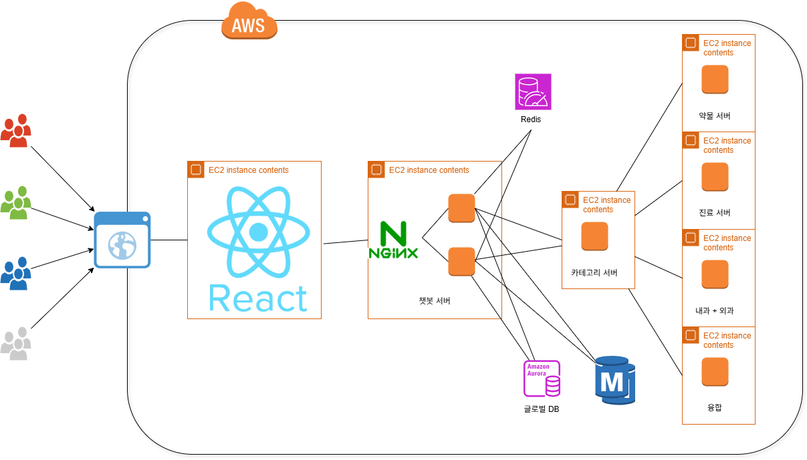

# Medical AI Chatbot Platform
**FastAPI 기반 LLM 연동 의료 서비스 서버**

**TEAM**: 윈도우즈  
**MEMBERS**: 권성호, 남의헌, 손현성, 이준배, 이준석  
**PART**: BACKEND DEVELOPMENT  

*의료 접근성 향상을 위한 AI 기반 상담 플랫폼*

---

# Medical AI Chatbot Platform

**TEAM**: 윈도우즈  
**MEMBERS**: 권성호, 남의헌, 손현성, 이준배, 이준석  
**PART**: BACKEND DEVELOPMENT  

*의료 접근성 향상을 위한 AI 기반 상담 플랫폼*

---

## ◎ 목 차 ◎

**Ⅰ. 포트폴리오 개요** ··················································· 1
1. Medical AI Chatbot Platform ··········································· 1
2. Template System ················································ 2
3. Microservices Architecture ·················································· 3

**Ⅱ. 기술 요약 및 UML** ················································ 4
1. Medical AI Chatbot Platform ··········································· 4
2. Template System ················································ 23
3. Microservices Architecture ·················································· 27

**Ⅲ. 별첨** ···································································· 44

---

# Ⅰ. 포트폴리오 개요

## 1. Medical AI Chatbot Platform

| 프로그램 명 | Medical AI Chatbot Platform |
|------------|---------------------------|
| 플랫폼 | Web Application (React + FastAPI) |
| **프로그램 개요** | |
| 프로그램 소개 | 의료 관련 LLM 및 다양한 도메인(카테고리, 약품, 병원, 응급지원 등) 지식을 연동한 FastAPI 기반 웹 서버 개발. 템플릿 시스템과 서비스 초기화 구조를 통해 확장성과 유지보수성을 높인 의료 QA/상담 챗봇 백엔드 구현 |
| 개발 기간 | 2024년 SKN 4차 프로젝트 |
| 개발 환경 | Python, FastAPI, uvicorn, LangChain |
| 설명 | 의료 서비스의 접근성 문제를 해결하기 위해 AI 기반 상담 플랫폼을 개발했습니다. 6개의 마이크로서비스(Chatbot, Category, Clinic, Drug, Emergency Support, Internal External)로 구성되어 있으며, 2단계 LLM 처리 파이프라인을 통해 정확도를 향상시켰습니다. Template 패턴을 적용하여 새로운 의료 도메인을 쉽게 추가할 수 있도록 설계했습니다. |
| GitHub URL | https://github.com/SKN12-4th-5TEAM |

---

### Ⅰ. 포트폴리오 개요

## 1. Medical AI Chatbot Platform

| 프로그램 명 | Medical AI Chatbot Platform |
|------------|---------------------------|
| 플랫폼 | Web Application (React + FastAPI) |

### 프로그램 개요



| **프로그램 소개** | 의료 관련 LLM 및 다양한 도메인 지식을 연동한 FastAPI 기반 의료 상담 챗봇 서버입니다. 각 도메인별(카테고리, 약품, 병원, 응급지원)로 특화된 마이크로서비스를 구축하여 확장 가능한 구조로 설계했습니다. |
|------------------|-----------------------------------------------------------------------------|
| **개발 기간** | 2024년 (SKN 4차 프로젝트) |
| **개발 환경** | Python + FastAPI + uvicorn + LangChain + OpenAI(gpt-4o-mini) |
| **설명** | 6개의 독립적인 마이크로서비스로 구성되어 있으며, 각 서비스는 Template 패턴을 기반으로 구현되어 새로운 의료 도메인을 쉽게 추가할 수 있습니다. 2단계 LLM 처리 파이프라인(Category Server → Chatbot Server)을 통해 전문성과 정확도를 향상시켰으며, RAG 시스템(FAISS + jhgan/ko-sroberta-multitask)을 구현하여 한국어 의료 정보 검색 성능을 최적화했습니다. |
| **GitHub URL** | https://github.com/SKN12-4th-5TEAM |

---

## 2. Template System

| 프로그램 명 | Template System |
|------------|---------------|
| 플랫폼 | Python Module |
| **프로그램 개요** | |
| 프로그램 소개 | BaseTemplate를 상속받은 도메인별 Template 구현체로 각 의료 서비스의 핵심 로직을 모듈화 |
| 개발 환경 | Python + ABC (Abstract Base Class) |
| 설명 | 1. BaseTemplate 추상 클래스<br/>모든 Template의 기본 인터페이스를 정의. init(), on_load_data(), on_client_create() 등의 라이프사이클 메서드 포함<br/>2. 도메인별 Template 구현<br/>AccountTemplate, ChatbotTemplate, CategoryTemplate, ClinicTemplate, DrugTemplate, EmergencyTemplate, InternalExternalTemplate 각각 구현<br/>3. Template Context<br/>Template 등록 및 관리를 담당. 런타임에 동적으로 Template 추가/제거 가능<br/>4. 템플릿 간 통신<br/>다른 Template의 기능을 호출할 수 있는 인터페이스 제공. 느슨한 결합 유지 |
| GitHub URL | https://github.com/SKN12-4th-5TEAM |

---

## 3. Microservices Architecture

| 프로그램 명 | Microservices Architecture |
|------------|--------------------------|
| 플랫폼 | Docker + FastAPI |
| **프로그램 개요** | |
| 프로그램 소개 | 6개의 독립적인 마이크로서비스로 구성된 의료 서비스 아키텍처 |
| 개발 환경 | FastAPI + aiohttp + MySQL + Redis + RabbitMQ |
| 설명 | 1. Chatbot Server (Port 8000)<br/>메인 API 게이트웨이, 인증 및 세션 관리, 2차 LLM 처리<br/>2. Category Server (Port 8001)<br/>의료 질문 분류, 도메인 라우팅, 1차 LLM 처리<br/>3. Clinic Server (Port 8002)<br/>병원 정보 조회 및 관리<br/>4. Drug Server (Port 8003)<br/>의약품 정보 RAG 처리<br/>5. Emergency Support Server (Port 8004)<br/>응급 상황 대응, FAISS 벡터 검색<br/>6. Internal External Server (Port 8005)<br/>마이크로서비스 간 내부 통신 관리 |
| GitHub URL | https://github.com/SKN12-4th-5TEAM |

---

# Ⅱ. 기술요약 및 UML

## 1. Medical AI Chatbot Platform

의료 도메인별 특화 서비스를 제공하는 AI 챗봇 플랫폼입니다. FastAPI 기반 마이크로서비스 아키텍처로 구성되어 있으며, Template 패턴을 적용하여 확장성과 유지보수성을 확보했습니다.

### 1.1 application/chatbot_server/main.py

```python
from fastapi import FastAPI
from contextlib import asynccontextmanager
from template.base.template_context import TemplateContext
from template.base.template_type import TemplateType
from service.db.database import MySQLPool
from service.cache.cache_config import CacheConfig
from service.cache.dependencies import init_cache
import os
import aiohttp

@asynccontextmanager
async def lifespan(app: FastAPI):
    """
    애플리케이션 생명주기 관리
    서버 시작 시 템플릿 등록, DB 풀 초기화, 캐시 초기화
    """
    # 1. Template 시스템 초기화
    from template.account.account_template_impl import AccountTemplateImpl
    from template.chatbot.chatbot_template_impl import ChatbotTemplateImpl
    
    TemplateContext.add_template(TemplateType.ACCOUNT, AccountTemplateImpl())
    TemplateContext.add_template(TemplateType.CHATBOT, ChatbotTemplateImpl())
    
    # 2. MySQL 샤딩 구조 초기화
    NUM_SHARDS = int(os.getenv("NUM_SHARDS", 2))
    app.state.userdb_pools = {}
    
    for shard_id in range(NUM_SHARDS):
        pool = MySQLPool()
        await pool.init(
            host=os.getenv(f"DB_SHARD_{shard_id}_HOST", "localhost"),
            port=int(os.getenv(f"DB_SHARD_{shard_id}_PORT", 3306)),
            user=os.getenv("DB_USER", "root"),
            password=os.getenv("DB_PASSWORD", "password"),
            db=f"medichain_shard_{shard_id}"
        )
        app.state.userdb_pools[shard_id] = pool
    
    # 3. Redis 캐시 초기화
    cache_config = CacheConfig(
        host=os.getenv("REDIS_HOST", "localhost"),
        port=int(os.getenv("REDIS_PORT", 6379)),
        session_expire_time=3600
    )
    init_cache(cache_config)
    
    # 4. HTTP Client Pool (마이크로서비스 간 통신)
    app.state.http_client = aiohttp.ClientSession()
    app.state.category_server_url = "http://localhost:8001"
    
    yield
    
    # Cleanup
    await app.state.http_client.close()
    for pool in app.state.userdb_pools.values():
        await pool.close()

app = FastAPI(lifespan=lifespan, title="Medical AI Chatbot Platform")
```

**프로젝트 참조**
- 템플릿 시스템을 통한 도메인별 로직 분리
- MySQL 샤딩을 통한 확장성 확보
- Redis 캐싱으로 성능 최적화
- 마이크로서비스 간 HTTP 통신 구조

---

### 1.1.1 Template Base 구조

각 의료 도메인의 공통 기능을 추상화한 기본 템플릿 구조입니다.

#### template/base/base_template.py

```python
from abc import ABC, abstractmethod

class BaseTemplate(ABC):
    """모든 템플릿의 기본 추상 클래스"""
    
    @abstractmethod
    def init(self, config):
        """템플릿 초기화"""
        pass
        
    @abstractmethod
    def on_load_data(self, config):
        """데이터 로딩"""
        pass
    
    @abstractmethod
    def on_client_create(self, db_client, client_session):
        """클라이언트 생성 시 콜백"""
        pass
    
    @abstractmethod
    def on_client_update(self, db_client, client_session):
        """클라이언트 업데이트 시 콜백"""
        pass
    
    @abstractmethod
    def on_client_delete(self, db_client, user_id):
        """클라이언트 삭제 시 콜백"""
        pass
```

**프로젝트 참조**
- 모든 Template가 구현해야 할 인터페이스 정의
- 라이프사이클 메서드를 통한 일관된 처리

---

### 1.1.2 ChatbotTemplate 구현

2단계 LLM 처리를 담당하는 핵심 템플릿입니다.

#### template/chatbot/chatbot_template_impl.py

```python
from template.base.template.chatbot_template import ChatbotTemplate
from service.cache.async_session import save_chat_history, load_chat_history
import openai
from datetime import datetime

class ChatbotTemplateImpl(ChatbotTemplate):
    def __init__(self):
        self.openai_client = openai.AsyncOpenAI()
    
    async def on_chatbot_message_req(self, client_session, request, app):
        """
        2단계 LLM 처리 파이프라인
        1차: Category Server에서 도메인 분류 및 초안 답변
        2차: 히스토리 컨텍스트 추가하여 최종 답변 생성
        """
        user_id = client_session.user_id
        room_id = request.roomId
        message = request.message
        
        # 1. Redis에서 대화 히스토리 로드
        history = await load_chat_history(user_id, room_id, limit=10)
        
        # 2. Category Server로 1차 처리 (도메인 분류)
        http_client = app.state.http_client
        category_server_url = app.state.category_server_url
        
        category_resp = await http_client.post(
            f"{category_server_url}/category/ask",
            json={"question": message}
        )
        category_answer = (await category_resp.json()).get("answer", "")
        
        # 3. 최종 LLM 호출 (gpt-4o-mini)
        final_answer = await self.call_final_llm(
            message, category_answer, history
        )
        
        # 4. Redis에 히스토리 저장
        bot_message = {
            "role": "bot",
            "content": final_answer,
            "timestamp": datetime.now().isoformat()
        }
        await save_chat_history(user_id, room_id, bot_message)
        
        return {"answer": final_answer, "history": history}
    
    async def call_final_llm(self, question: str, draft_answer: str, history: list):
        """최종 LLM 호출 (히스토리 컨텍스트 포함)"""
        context = ""
        if history:
            recent_messages = history[-5:]
            context = " ".join([msg["content"] for msg in recent_messages])
        
        prompt = f"""
        [사용자 질문] {question}
        [카테고리 전용 LLM 응답] {draft_answer}
        [이전 대화] {context}
        """
        
        response = await self.openai_client.chat.completions.create(
            model="gpt-4o-mini",
            messages=[
                {"role": "system", "content": "너는 의료 전문 챗봇이야."},
                {"role": "user", "content": prompt}
            ],
            temperature=0.3,
            max_tokens=512
        )
        return response.choices[0].message.content
```

**프로젝트 참조**
- 2단계 LLM 처리로 정확도 향상
- Redis 기반 대화 히스토리 관리
- 비동기 처리를 통한 성능 최적화

---

### 1.2 RAG 시스템 구현

한국어 의료 정보 검색을 위한 RAG 파이프라인입니다.

#### service/lang_chain/emergency_support_lang_chain.py

```python
import faiss
import numpy as np
from sentence_transformers import SentenceTransformer
from langchain_core.prompts import PromptTemplate
from langchain_openai import ChatOpenAI

def load_embedding_model():
    """한국어 특화 임베딩 모델 로드"""
    return SentenceTransformer("jhgan/ko-sroberta-multitask")

def load_faiss_index(index_path: str):
    """FAISS 인덱스 로드"""
    return faiss.read_index(index_path)

def load_chunks(chunk_path: str):
    """텍스트 청크 로드"""
    with open(chunk_path, "r", encoding="utf-8") as f:
        return [c.strip() for c in f.read().split("\n\n") if c.strip()]

def build_rag_chain(openai_api_key: str):
    """LangChain RAG 체인 빌드"""
    prompt = PromptTemplate.from_template(
        "당신은 의학전공을 하여 저희의 질문에 대답을 잘 해주는 챗봇입니다"
        "다음은 사용자의 질문에 답하기 위한 참고 문서입니다:\n\n"
        "{context}\n\n"
        "질문: {question}\n"
        "답변:"
    )
    llm = ChatOpenAI(model="gpt-4o-mini", temperature=0)
    return prompt | llm

async def get_rag_answer_async(question, index, chunks, embed_model, rag_chain):
    """RAG 파이프라인 실행"""
    # 1. FAISS로 유사 문서 검색
    embedding = embed_model.encode([question])
    _, indices = index.search(np.array(embedding).astype("float32"), 3)
    top_chunks = [chunks[i] for i in indices[0]]
    context = "\n".join(top_chunks)
    
    # 2. LLM으로 답변 생성
    answer = await rag_chain.ainvoke({
        "context": context,
        "question": question
    })
    return answer
```

**프로젝트 참조**
- jhgan/ko-sroberta-multitask: 한국어 특화 임베딩
- FAISS: 고성능 벡터 검색
- LangChain: LLM 오케스트레이션

---

## 2. 시퀀스 다이어그램

### 2.1 서버 초기화 시퀀스

```
┌─────────────┐     ┌─────────────┐     ┌─────────┐     ┌───────┐
│   FastAPI   │     │  Template   │     │  MySQL  │     │ Redis │
└──────┬──────┘     └──────┬──────┘     └────┬────┘     └───┬───┘
       │                    │                  │              │
       │ 1. lifespan start  │                  │              │
       ├───────────────────>│                  │              │
       │                    │                  │              │
       │ 2. Template 등록   │                  │              │
       │<───────────────────┤                  │              │
       │                    │                  │              │
       │ 3. MySQL Pool 초기화                  │              │
       ├─────────────────────────────────────>│              │
       │                    │                  │              │
       │ 4. Redis 초기화    │                  │              │
       ├──────────────────────────────────────────────────────>│
       │                    │                  │              │
       │ 5. Ready           │                  │              │
       │                    │                  │              │
```

### 2.2 2단계 LLM 처리 시퀀스

```
┌────────┐   ┌─────────────┐   ┌──────────────┐   ┌─────────────┐
│ Client │   │Chatbot Server│   │Category Server│   │    Redis    │
└───┬────┘   └──────┬───────┘   └───────┬──────┘   └──────┬──────┘
    │               │                     │                 │
    │ 1. 질문 요청  │                     │                 │
    ├──────────────>│                     │                 │
    │               │                     │                 │
    │               │ 2. 히스토리 로드    │                 │
    │               ├─────────────────────────────────────>│
    │               │<─────────────────────────────────────┤
    │               │                     │                 │
    │               │ 3. 1차 LLM 처리    │                 │
    │               ├────────────────────>│                 │
    │               │<────────────────────┤                 │
    │               │                     │                 │
    │               │ 4. 2차 LLM 처리    │                 │
    │               │ (gpt-4o-mini)      │                 │
    │               │                     │                 │
    │               │ 5. 히스토리 저장   │                 │
    │               ├─────────────────────────────────────>│
    │               │                     │                 │
    │ 6. 최종 답변 │                     │                 │
    │<──────────────┤                     │                 │
    │               │                     │                 │
```

### 2.3 RAG 처리 시퀀스

```
┌────────┐   ┌──────────────┐   ┌────────┐   ┌──────────┐
│ Client │   │Emergency Server│   │ FAISS  │   │  OpenAI  │
└───┬────┘   └───────┬────────┘   └───┬────┘   └─────┬────┘
    │                │                 │              │
    │ 1. 응급 질문  │                 │              │
    ├───────────────>│                 │              │
    │                │                 │              │
    │                │ 2. 임베딩 생성 │              │
    │                ├────────────────>│              │
    │                │                 │              │
    │                │ 3. 유사문서검색│              │
    │                │<────────────────┤              │
    │                │                 │              │
    │                │ 4. LLM 호출    │              │
    │                ├─────────────────────────────>│
    │                │<─────────────────────────────┤
    │                │                 │              │
    │ 5. RAG 답변   │                 │              │
    │<───────────────┤                 │              │
    │                │                 │              │
```

---

## 3. 데이터베이스 구조

### 3.1 MySQL 샤딩 구조

```sql
-- Global DB
CREATE DATABASE medichain_global;
USE medichain_global;

CREATE TABLE users (
    user_id BIGINT PRIMARY KEY AUTO_INCREMENT,
    site_id VARCHAR(100),
    server_id INT,
    shard_id INT,
    created_at TIMESTAMP DEFAULT CURRENT_TIMESTAMP,
    INDEX idx_site_server (site_id, server_id)
);

-- Shard DB (0, 1)
CREATE DATABASE medichain_shard_0;
USE medichain_shard_0;

CREATE TABLE chat_room (
    chat_id BIGINT PRIMARY KEY AUTO_INCREMENT,
    user_id BIGINT,
    title VARCHAR(255),
    created_at TIMESTAMP DEFAULT CURRENT_TIMESTAMP,
    INDEX idx_user (user_id)
);
```

### 3.2 Redis 구조

```python
# 채팅 히스토리 키 구조
chat:{user_id}:{room_id} → List[Message]

# 세션 키 구조  
session:{user_id} → SessionData

# 캐시 키 구조
cache:rag:{question_hash} → Answer
```

---

# Ⅲ. 별첨

## 1) GitHub
Medical AI Chatbot Platform : https://github.com/SKN12-4th-5TEAM

## 2) 산출물
- 요구사항 정의서 : ./산출물/요구사항 정의서.hwp
- 화면설계서 : ./산출물/화면 설계서.pdf  
- 테스트 계획 및 결과 보고서 : ./산출물/테스트계획 및 결과보고서.pdf
- 시스템 구성도 : ./산출물/5조 시스템 아키텍처 및 구성도.pdf

## 3) 팀원 소감

| 이름 | 소감 |
|------|------|
| **권성호** | 포기하려 했지만 팀원들 덕분에 끝까지 프로젝트를 완수했습니다. |
| **남의헌** | 서버에 대한 지식을 많이 배워갈 수 있는 시간이었습니다. |
| **손현성** | 이슈가 있었는데 팀원분들 덕분에 프로젝트가 잘 마무리 된 것 같습니다. |
| **이준배** | 다들 포기하지 않고 끝까지 노력한 덕분에 완성할 수 있었습니다. |
| **이준석** | 많이 부족했는데, 다들 많이 신경써주셔서 성공적으로 끝낼 수 있었습니다. |

---