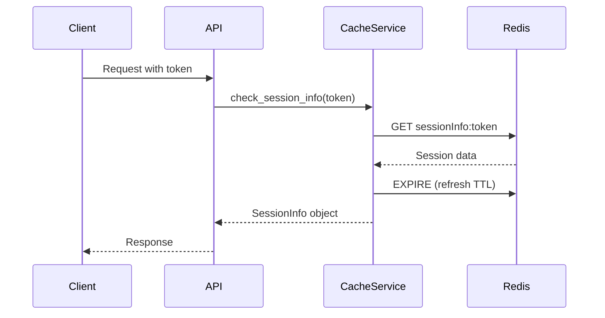

# Cache Service Module

## 📌 모듈 개요
Cache 서비스는 **Redis 기반의 세션 관리와 임시 데이터 저장**을 담당하는 핵심 인프라 모듈입니다. 분산 시스템에서 상태 관리와 성능 최적화를 위한 캐싱 레이어를 제공합니다.

## 🎯 왜 이 파일들이 함께 묶여있는가?

### 응집도 기반 모듈화
```
cache/
├── async_session.py    # Redis 세션 CRUD 작업
├── cache_config.py     # Redis 연결 설정
└── dependencies.py     # FastAPI 의존성 주입
```

이 세 파일은 **"캐싱과 세션 관리"라는 단일 책임**을 공유합니다:
- `cache_config.py`: 설정의 중앙화
- `async_session.py`: 실제 캐싱 로직
- `dependencies.py`: 상위 레이어와의 통합

## 🏗️ 아키텍처적 의사결정

### 1. 왜 Redis를 선택했는가?
- **인메모리 속도**: 밀리초 단위 응답 시간
- **TTL 지원**: 자동 세션 만료 관리
- **분산 환경 지원**: 여러 서버 인스턴스 간 세션 공유
- **Pub/Sub**: 실시간 이벤트 처리 가능

### 2. 왜 비동기(async/await)를 사용하는가?
```python
async def get_session_info(access_token: str) -> SessionInfo | None:
    session_json = await r.get(f"sessionInfo:{access_token}")
```
- **Non-blocking I/O**: Redis 작업 중 다른 요청 처리 가능
- **높은 동시성**: 수천 개의 동시 세션 처리
- **리소스 효율성**: 스레드 오버헤드 없음

### 3. 키 네이밍 전략
```python
f"accessToken:{access_token}"
f"sessionInfo:{access_token}"
f"chat_history:{user_id}:{room_id}"
```
- **계층적 구조**: 콜론으로 네임스페이스 분리
- **디버깅 용이성**: 키 패턴으로 데이터 유형 식별
- **Redis 클러스터 최적화**: 해시 태그 활용 가능

## 💡 핵심 설계 패턴

### Singleton Pattern
```python
r: Optional[redis.Redis] = None  # 전역 Redis 인스턴스

def init_cache(config: CacheConfig):
    global r
    r = redis.Redis(...)
```
**이유**: Redis 연결은 비용이 크므로 애플리케이션 생명주기 동안 하나만 유지

### Dependency Injection
```python
async def require_session(request: Request):
    # FastAPI의 의존성 주입 시스템 활용
```
**이유**: 테스트 가능성과 모듈 간 느슨한 결합

## 🔄 데이터 플로우



## ⚡ 성능 최적화 전략

### 1. 세션 TTL 관리
```python
SESSION_EXPIRE_MINUTES = config.session_expire_time // 60
```
- **자동 정리**: 만료된 세션 자동 삭제
- **메모리 효율**: Redis 메모리 사용량 최적화

### 2. 원자적 연산
```python
await r.setex(key, expire_time, value)  # SET + EXPIRE를 원자적으로
```
- **Race Condition 방지**: 동시 요청 처리 시 데이터 일관성 보장

### 3. 파이프라이닝 준비
```python
# 향후 확장 가능
async def bulk_get_sessions(tokens: List[str]):
    pipe = r.pipeline()
    for token in tokens:
        pipe.get(f"sessionInfo:{token}")
    return await pipe.execute()
```

## 🔐 보안 고려사항

### 1. 세션 검증
```python
if session_info.session_state != ClientSessionState.NONE:
    return None  # 비정상 상태 세션 거부
```

### 2. 토큰 기반 인증
- 세션 ID 대신 토큰 사용으로 CSRF 공격 방지
- 각 요청마다 토큰 검증

### 3. TTL 기반 자동 로그아웃
- 일정 시간 후 자동 세션 만료
- 세션 하이재킹 위험 감소

## 📊 모니터링 포인트

- **Cache Hit Rate**: 캐시 효율성 측정
- **Average Response Time**: Redis 응답 시간
- **Memory Usage**: Redis 메모리 사용량
- **Active Sessions**: 동시 세션 수

## 🚀 확장 가능성

### 1. Redis Cluster 지원
```python
# 향후 확장
from redis.cluster import RedisCluster
r = RedisCluster(startup_nodes=[...])
```

### 2. 다중 캐시 레벨
```python
# L1: 로컬 메모리 캐시
# L2: Redis
# L3: Database
```

### 3. 캐시 워밍
```python
async def warm_cache():
    # 자주 사용되는 데이터 미리 로드
```

## 🎓 이 모듈에서 배울 수 있는 것

1. **분산 세션 관리**: 스테이트리스 아키텍처에서 상태 관리
2. **비동기 프로그래밍**: async/await 패턴의 실제 적용
3. **캐싱 전략**: TTL, 키 네이밍, 메모리 관리
4. **의존성 주입**: FastAPI와 통합된 DI 패턴
5. **에러 핸들링**: 연결 실패, 타임아웃 처리