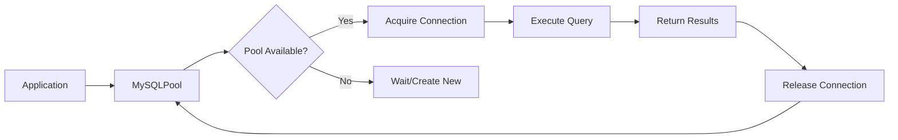

# Database Service Module

## 📌 모듈 개요
Database 서비스는 **MySQL 연결 풀 관리와 데이터베이스 작업 추상화**를 담당합니다. 비동기 기반의 효율적인 데이터베이스 접근 계층을 제공합니다.

## 🎯 왜 이 파일들이 함께 묶여있는가?

### 관심사 분리와 응집도
```
db/
├── database.py         # MySQL 연결 풀 및 쿼리 실행
└── database_config.py  # 데이터베이스 설정 스키마
```

**묶인 이유**:
- **단일 책임**: "영구 데이터 저장소 관리"라는 하나의 목적
- **높은 응집도**: 설정(Config)과 구현(Pool)이 긴밀하게 연관
- **낮은 결합도**: 다른 서비스와 독립적으로 동작

## 🏗️ 아키텍처적 의사결정

### 1. 왜 Connection Pool을 사용하는가?

```python
async def init(self, host, port, user, password, db, minsize=5, maxsize=20):
    self.pool = await aiomysql.create_pool(...)
```

**이유**:
- **연결 재사용**: DB 연결 생성/해제 오버헤드 제거
- **동시성 제어**: maxsize로 DB 부하 제한
- **성능 최적화**: 연결 대기 시간 최소화
- **리소스 관리**: 연결 누수 방지

### 2. 왜 비동기 MySQL (aiomysql)인가?

```python
async with self.pool.acquire() as conn:
    async with conn.cursor(aiomysql.DictCursor) as cur:
```

**선택 이유**:
- **Non-blocking I/O**: DB 쿼리 중 다른 요청 처리
- **높은 처리량**: 동시 다중 쿼리 실행
- **FastAPI와 일관성**: 전체 스택이 async/await
- **컨텍스트 관리**: `async with`로 자동 리소스 정리

### 3. 왜 DictCursor를 사용하는가?

```python
async with conn.cursor(aiomysql.DictCursor) as cur:
```

**이점**:
- **가독성**: 컬럼명으로 데이터 접근
- **유지보수성**: 스키마 변경에 강건
- **JSON 직렬화**: FastAPI 응답과 호환

## 💡 핵심 설계 패턴

### 1. Object Pool Pattern
```python
class MySQLPool:
    def __init__(self):
        self.pool = None  # 연결 풀 객체
```
**목적**: 비싼 리소스(DB 연결)를 재사용하여 성능 향상

### 2. Context Manager Pattern
```python
async with self.pool.acquire() as conn:
    # 자동으로 연결 획득/반환
```
**장점**: 예외 발생 시에도 안전한 리소스 해제

### 3. Strategy Pattern (암시적)
```python
if query.strip().lower().startswith("select"):
    return await cur.fetchall()
return cur.lastrowid
```
**의도**: 쿼리 유형에 따른 다른 응답 전략

## 🔄 데이터 플로우



## ⚡ 성능 최적화 전략

### 1. Connection Pool 튜닝
```python
minsize=5   # 최소 연결 수 (기본 대기)
maxsize=20  # 최대 연결 수 (피크 시간 대응)
```

**튜닝 가이드**:
- `minsize`: 평균 동시 요청 수
- `maxsize`: 피크 시간 동시 요청 수 * 1.5

### 2. Autocommit 활성화
```python
autocommit=True  # 트랜잭션 자동 커밋
```

**이유**:
- 간단한 쿼리의 성능 향상
- 명시적 트랜잭션 관리 불필요
- 데드락 위험 감소

### 3. Prepared Statement (Stored Procedure)
```python
async def call_procedure(self, proc_name: str, params: tuple = ()):
    await cur.callproc(proc_name, params)
```

**장점**:
- SQL Injection 방지
- 쿼리 플랜 캐싱
- 네트워크 트래픽 감소

## 🔐 보안 고려사항

### 1. 파라미터화된 쿼리
```python
await cur.execute(query, params)  # 파라미터 분리
```
- SQL Injection 완벽 차단
- 특수 문자 자동 이스케이프

### 2. 연결 정보 보호
```python
class DatabaseConfig(BaseModel):
    aws_secret_access_key: str = ""  # 환경 변수로 관리
    firestore_private_key: str = ""  # 절대 하드코딩 금지
```

### 3. 최소 권한 원칙
- 애플리케이션별 전용 DB 사용자
- 필요한 최소한의 권한만 부여

## 📊 모니터링 포인트

```python
# 향후 추가 가능한 메트릭
async def get_pool_stats(self):
    return {
        "size": self.pool.size,
        "freesize": self.pool.freesize,
        "maxsize": self.pool.maxsize,
        "minsize": self.pool.minsize
    }
```

- **활성 연결 수**: 현재 사용 중인 연결
- **대기 큐 길이**: 연결 대기 중인 요청
- **쿼리 응답 시간**: 평균/최대 실행 시간
- **에러율**: 연결 실패, 타임아웃

## 🚀 확장 가능성

### 1. 샤딩 지원
```python
# main.py에서 이미 구현
app.state.userdb_pools = {}  # 샤드별 풀 관리
```

### 2. Read Replica 지원
```python
class MySQLPool:
    def __init__(self):
        self.write_pool = None
        self.read_pools = []  # 여러 읽기 전용 DB
```

### 3. 쿼리 캐싱 레이어
```python
async def execute_cached(self, query, params, ttl=60):
    cache_key = f"{query}:{params}"
    # Redis 캐시 확인 후 DB 쿼리
```

## 🎓 이 모듈에서 배울 수 있는 것

1. **Connection Pooling**: 데이터베이스 연결 최적화
2. **비동기 프로그래밍**: async/await의 DB 적용
3. **리소스 관리**: Context Manager 활용
4. **보안 실천**: SQL Injection 방지
5. **확장성 설계**: 샤딩, 레플리카 고려

## 🔗 다른 모듈과의 관계

- **template 모듈**: 비즈니스 로직에서 DB 서비스 호출
- **cache 모듈**: 쿼리 결과 캐싱으로 협력
- **application 모듈**: lifespan에서 풀 초기화/정리

## ⚠️ 주의사항

1. **연결 누수 방지**: 항상 `async with` 사용
2. **타임아웃 설정**: 장시간 쿼리 방지
3. **에러 핸들링**: 연결 실패 시 재시도 로직
4. **풀 크기 조정**: 모니터링 기반 튜닝