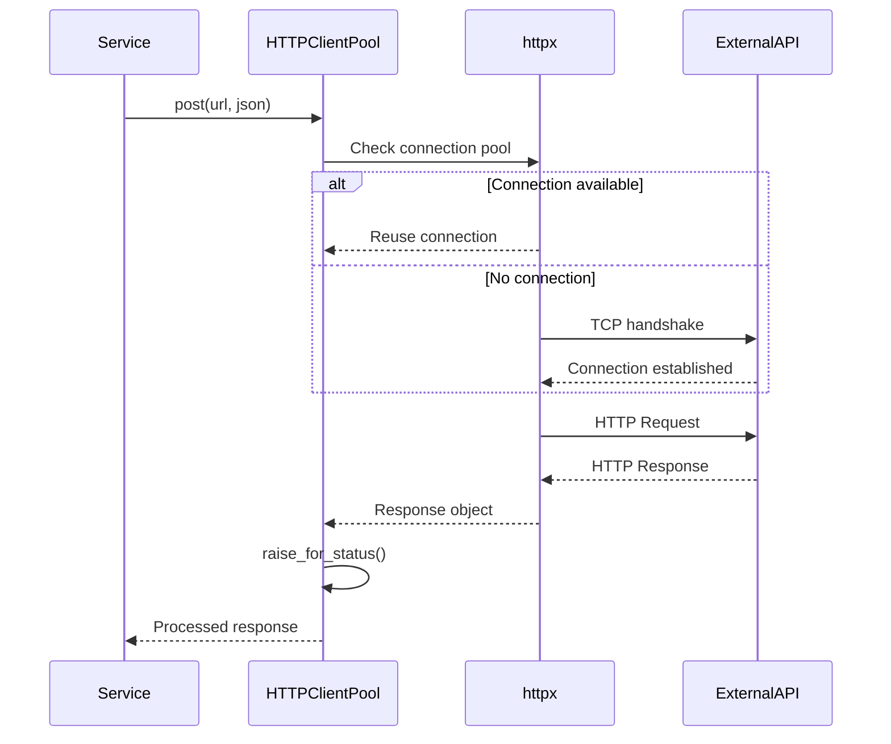

# HTTP Service Module

## 📌 모듈 개요
HTTP 서비스는 **외부 API 통신과 마이크로서비스 간 통신**을 담당하는 네트워크 클라이언트 모듈입니다. 비동기 HTTP 연결 풀을 관리하여 효율적인 네트워크 통신을 제공합니다.

## 🎯 왜 이 파일이 독립 모듈인가?

### 단일 책임 원칙 (SRP)
```
http/
└── http_client.py  # HTTP 클라이언트 풀 관리
```

**독립 모듈인 이유**:
- **명확한 경계**: HTTP 통신이라는 단일 책임
- **재사용성**: 모든 서비스에서 공통으로 사용
- **테스트 용이성**: 네트워크 계층 모킹 가능
- **확장성**: 새로운 HTTP 기능 추가 시 한 곳에서 관리

## 🏗️ 아키텍처적 의사결정

### 1. 왜 httpx를 선택했는가?

```python
self.client = httpx.AsyncClient(...)
```

**httpx vs requests vs aiohttp 비교**:
- **async/await 네이티브 지원**: FastAPI와 완벽 호환
- **HTTP/2 지원**: 멀티플렉싱으로 성능 향상
- **연결 풀 내장**: 자동 연결 관리
- **타입 힌팅**: 모던 Python 코드베이스
- **requests API 호환**: 낮은 학습 곡선

### 2. 왜 Connection Pool을 사용하는가?

```python
limits=httpx.Limits(
    max_connections=100,      # 전체 최대 연결
    max_keepalive_connections=20  # Keep-alive 연결
)
```

**이점**:
- **TCP 핸드셰이크 절약**: 연결 재사용으로 지연 시간 감소
- **리소스 효율성**: 연결 수 제한으로 서버 부하 제어
- **처리량 향상**: 동시 다중 요청 처리

### 3. 왜 클래스로 래핑했는가?

```python
class HTTPClientPool:
    def __init__(self, max_connections=100, ...):
```

**설계 이유**:
- **설정 중앙화**: 타임아웃, 연결 수 등 일관된 설정
- **생명주기 관리**: 애플리케이션 시작/종료 시 관리
- **확장 포인트**: 인터셉터, 재시도 로직 추가 가능
- **의존성 주입**: FastAPI의 DI 컨테이너와 통합

## 💡 핵심 설계 패턴

### 1. Facade Pattern
```python
async def get(self, url, **kwargs):
    response = await self.client.get(url, **kwargs)
    response.raise_for_status()  # 에러 자동 처리
    return response
```
**목적**: 복잡한 httpx API를 간단한 인터페이스로 제공

### 2. Object Pool Pattern
```python
max_connections=100  # 연결 풀 크기
max_keepalive_connections=20  # 재사용 연결
```
**효과**: HTTP 연결을 풀링하여 성능 최적화

### 3. Template Method Pattern (암시적)
```python
async def post(self, url, data=None, json=None, **kwargs):
    # 1. 요청 전송
    # 2. 에러 체크
    # 3. 응답 반환
```
**의도**: 모든 HTTP 메서드에 일관된 처리 흐름

## 🔄 통신 플로우



## ⚡ 성능 최적화 전략

### 1. Connection Pooling 튜닝
```python
max_connections=100  # 동시 요청 처리 능력
max_keepalive_connections=20  # 유휴 연결 유지
```

**튜닝 가이드**:
- `max_connections`: 예상 동시 요청 수 * 1.5
- `max_keepalive`: 자주 통신하는 호스트 수
- 모니터링 후 조정 필요

### 2. Timeout 전략
```python
timeout=10.0  # 기본 10초 타임아웃
```

**고려사항**:
- **Connect timeout**: 연결 수립 시간
- **Read timeout**: 응답 대기 시간
- **Pool timeout**: 연결 풀 대기 시간

### 3. HTTP/2 멀티플렉싱
```python
# httpx는 자동으로 HTTP/2 지원
# 하나의 연결로 여러 요청 동시 처리
```

## 🔐 보안 고려사항

### 1. 자동 에러 처리
```python
response.raise_for_status()  # 4xx, 5xx 에러 자동 예외
```
- 에러 응답 조기 감지
- 일관된 에러 처리

### 2. SSL/TLS 검증
```python
# 기본적으로 SSL 인증서 검증
# 필요시 커스텀 설정 가능
verify=True  # 기본값
```

### 3. 헤더 주입 방지
```python
async def post(self, url, data=None, json=None, **kwargs):
    # kwargs로 유연하게 헤더 추가
    # 하지만 검증 로직 추가 가능
```

## 📊 모니터링 포인트

```python
# 향후 추가 가능한 메트릭
async def get_stats(self):
    return {
        "active_connections": len(self.client._pool),
        "pending_requests": self.client._pool.pending,
        "total_requests": self.client._pool.total_requests
    }
```

- **응답 시간**: 평균/P95/P99 레이턴시
- **에러율**: 타임아웃, 연결 실패
- **처리량**: 초당 요청 수
- **연결 풀 사용률**: 활성/유휴 연결

## 🚀 확장 가능성

### 1. 재시도 로직
```python
async def get_with_retry(self, url, max_retries=3):
    for i in range(max_retries):
        try:
            return await self.get(url)
        except httpx.TimeoutException:
            if i == max_retries - 1:
                raise
            await asyncio.sleep(2 ** i)  # 지수 백오프
```

### 2. 서킷 브레이커
```python
class CircuitBreaker:
    def __init__(self, failure_threshold=5):
        self.failures = 0
        self.is_open = False
```

### 3. 요청/응답 인터셉터
```python
async def add_auth_header(self, request):
    request.headers["Authorization"] = f"Bearer {token}"
```

## 🎓 이 모듈에서 배울 수 있는 것

1. **HTTP 연결 풀링**: 네트워크 리소스 최적화
2. **비동기 HTTP 통신**: async/await 기반 네트워킹
3. **마이크로서비스 통신**: 서비스 간 API 호출
4. **에러 핸들링**: HTTP 상태 코드 처리
5. **성능 최적화**: Keep-alive, HTTP/2 활용

## 🔗 다른 모듈과의 관계

### 사용하는 곳
- **application/chatbot_server**: 카테고리 서버와 통신
- **template 모듈**: 외부 API 호출
- **lang_chain 모듈**: OpenAI API 호출 (간접적)

### 협력 관계
- **cache 모듈**: API 응답 캐싱
- **net 모듈**: 프로토콜 기반 통신

## ⚠️ 주의사항

1. **메모리 누수**: 클라이언트 종료 시 `aclose()` 호출 필수
2. **타임아웃 설정**: 무한 대기 방지
3. **에러 전파**: `raise_for_status()` 후 적절한 처리
4. **연결 제한**: 대상 서버의 rate limit 고려

## 💭 설계 철학

이 모듈은 **"Don't Repeat Yourself"** 원칙을 따릅니다:
- 모든 HTTP 통신 로직을 한 곳에 집중
- 일관된 에러 처리와 설정
- 재사용 가능한 연결 풀

마이크로서비스 아키텍처에서 **서비스 간 통신은 핵심**이며, 이 모듈은 그 기반을 제공합니다.